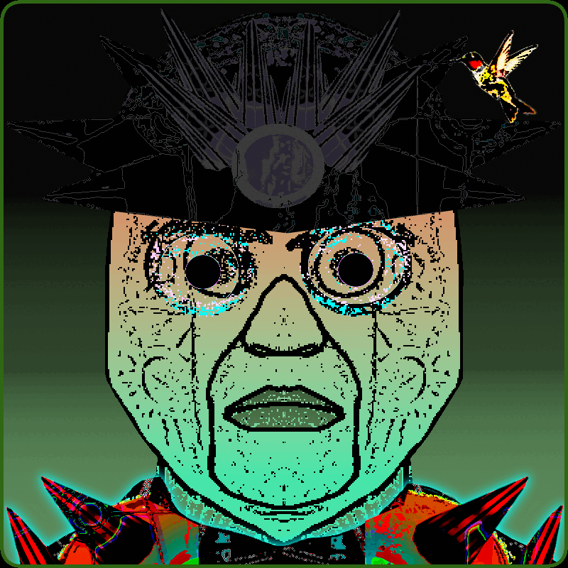
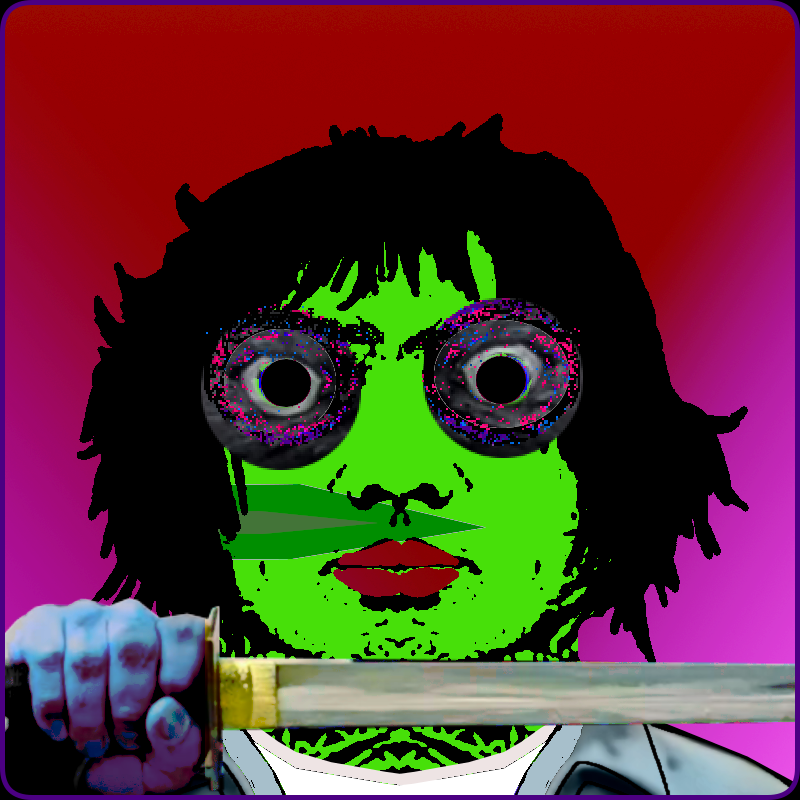
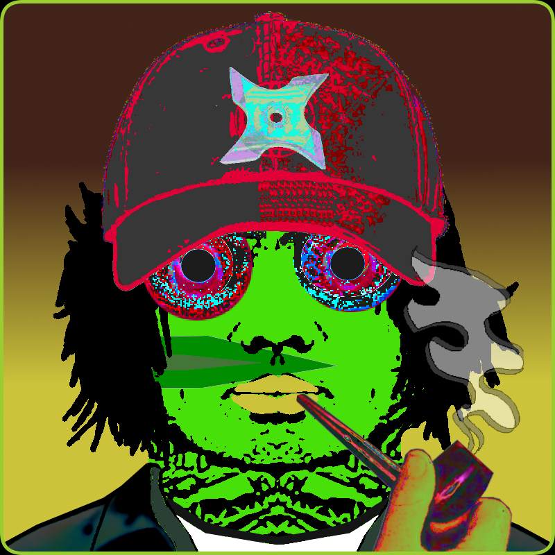

# Chromatic Sun Ranch

项目网站、社交联系方式、项目介绍内容详见：https://opensea.io/collection/chromatic-sun-ranch

 Chromatic Sun Ranch 是一个探索、互动或享受这个存在位面的自然美景的地方。牧场创始人有一个匿名与和平的愿景。这个位置是秘密的，在遥远的星系集合中非常模糊，这些星系在时间之外交织在一起。在牧场，我们都是朋友。所有人都知道，如果你在这里，那是有充分理由的。这些原因因宇宙而异，但我们的客人都有自己独特的知识、精致和技能，尊重对所有进入的人至关重要。

设施本质上是公用的，鼓励在户外睡觉。有山和森林可以远足。观赏乐趣和游泳的海洋。牧场附近的许多动物都具有神奇的属性。大多数会增强您的体验，但有些可能会让您感觉与多元宇宙中大多数动物文化常见的许多天然精神活性物质相似。如果您想避免这些改动，只需请求任何附魔物品并将其随身携带即可。无论哪种方式，请确保这个世界是安全的，您的本源和宇宙的所有精神和状态都将保持不变；这是您在整个宇宙中的许多其他此类努力中找不到的保证；除了可能和银河系的和尚打坐

 

