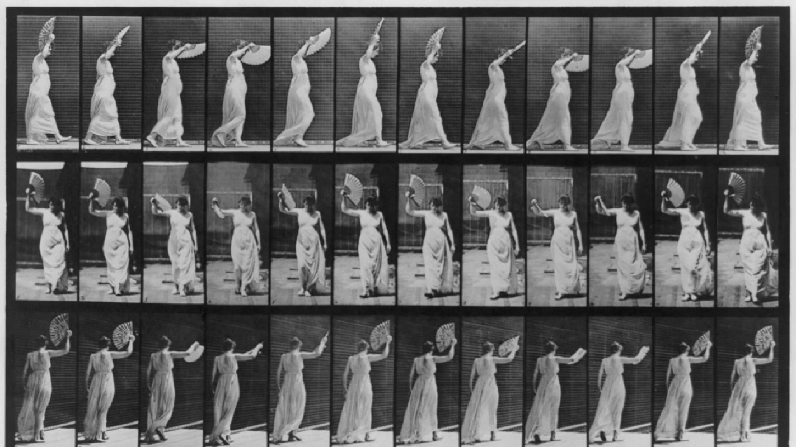
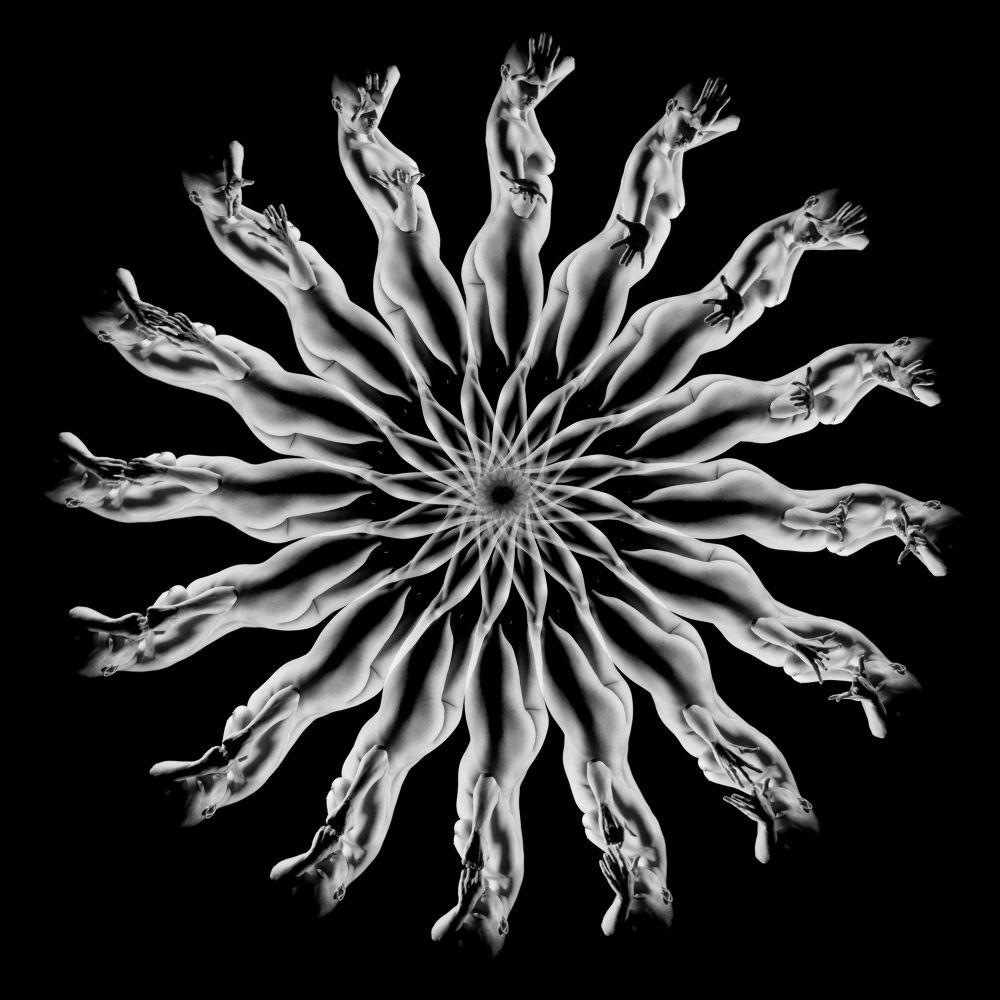
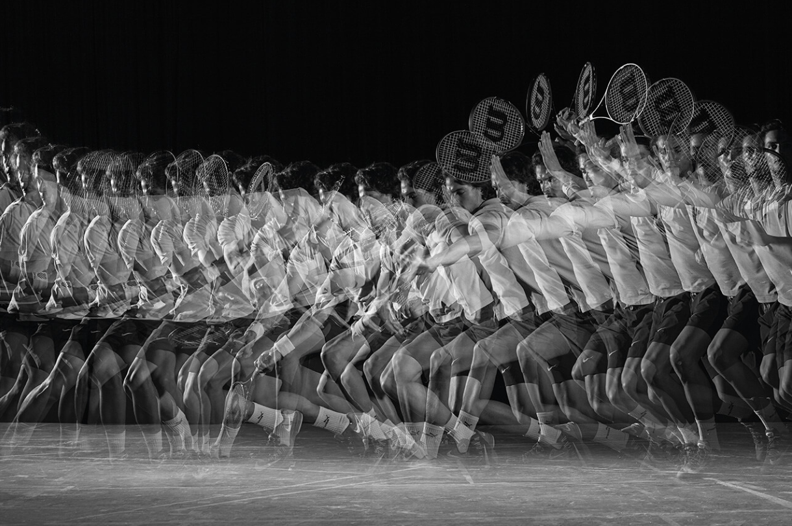

# Chronophotography

项目网站、社交联系方式、项目介绍内容详见：https://opensea.io/collection/chronophotography

计时摄影是一种涉及长时间拍摄延时摄影的技术。它最常用于创建持续时间长、帧速率高的视频，让观众以慢动作观察自然世界的现象。

为了达到这种效果，必须使用极长的曝光，例如，以便在一天中捕获大量帧。然后将这些帧组合成视频格式，每一帧对应一个时间点。

计时摄影技术涉及在预定的时间内拍摄一系列静态照片（非常类似于现代延时摄影），然后将它们排列成一张照片进行分析。以前用于拍摄快速移动物体的一系列瞬时照片的设备。由这种设备拍摄的照片。一种计时码表，其中的追踪或记录是由一束光在敏感表面上进行的。

