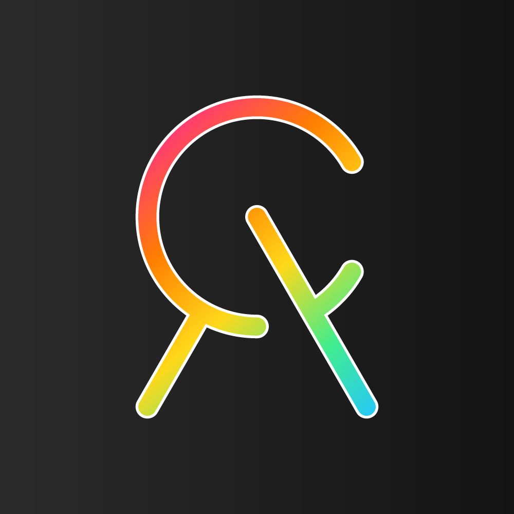
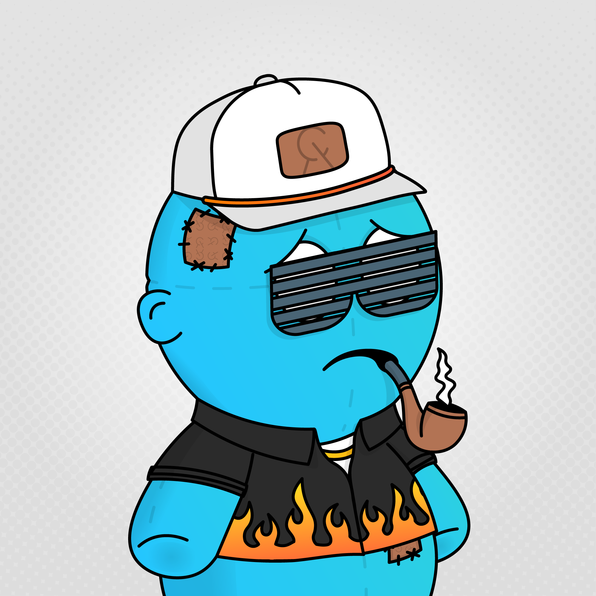

# Chubby Anxiety Society

项目网站、社交联系方式、项目介绍内容详见：https://opensea.io/collection/chubbyanxiety

##### ▶ 什么是胖乎乎的焦虑社会？

Chubby Anxiety Society 是一个 NFT（不可替代代币）集合。存储在区块链上的数字艺术品集合。

##### ▶ 有多少 Chubby Anxiety Society 代币？

总共有 5,000 个 Chubby Anxiety Society NFT。目前，600 位车主的钱包里至少有一个 Chubby Anxiety Society NTF。

##### ▶ Chubby Anxiety Society 最昂贵的销售是什么？

出售的最昂贵的 Chubby Anxiety Society NFT 是 [Chanxy #3502](https://www.nft-stats.com/asset/0x0c917dcfd7f145d3000738c923ed10f7055ce31f/3502)。它于 2022-06-29（大约 2 个月前）以 109.8 美元的价格售出。

##### ▶ 胖乎乎的焦虑社最近卖了多少？

过去 30 天内售出了 230 个 Chubby Anxiety Society NFT。

##### ▶ 胖乎乎的焦虑协会的费用是多少？

过去 30 天，最便宜的 Chubby Anxiety Society NFT 销售额低于 1 美元，最高销售额超过 5 美元。过去 30 天，Chubby Anxiety Society NFT 的中位价格为 2 美元。

 
