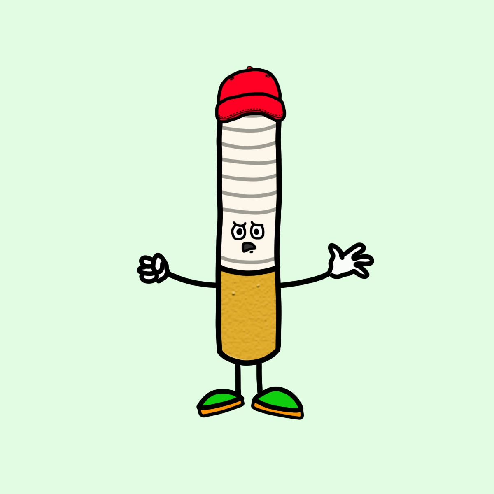

# Free Ciggy

项目网站、社交联系方式、项目介绍内容详见：https://opensea.io/collection/ciggy-v2

▶ 什么是免费 Ciggy？
Free Ciggy 是一个 NFT（非同质代币）集合。存储在区块链上的数字艺术品集合。
▶ 有多少免费 Ciggy 代币？
总共有 999 个免费的 Ciggy NFT。目前，140 位车主的钱包中至少有一个 Free Ciggy NTF。
▶ Free Ciggy 最昂贵的促销活动是什么？
出售的最昂贵的免费 Ciggy NFT 是 Ciggy #65。它于 2022-07-04（大约 2 个月前）以 9.7 美元的价格售出。
▶ 最近卖出了多少 Free Ciggy？
过去 30 天内售出了 5 个免费的 Ciggy NFT。

