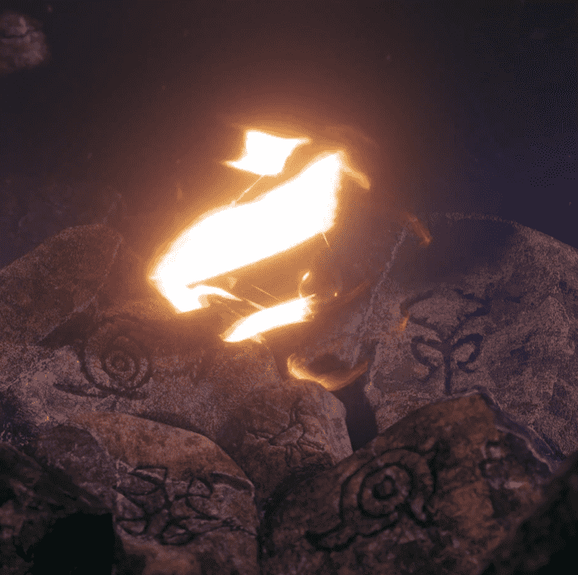

# Gotterhavn - Circle of Aristocrats

随着齐尔根抵达哥特港，大裂隙的一道屏障被攻破。 腐朽已经开始在仙界蔓延。 空气中弥漫着紧张的气氛。 为了武装他们的人民，众神和女神下令将一些遗物送给拥有并将为他们服务的忠实家庭，作为他们忠诚的象征和强大的武器。 贵族戒指就是其中的一部分。拥有贵族戒指可以授予您在哥特港社区的贵族等级。 您拥有的戒指数量将决定您可以从我们的主要收藏中铸造的免费 NFT 数量以及您将从主要收藏每月交易量交易的 40% 股息中获得的份额数量！

