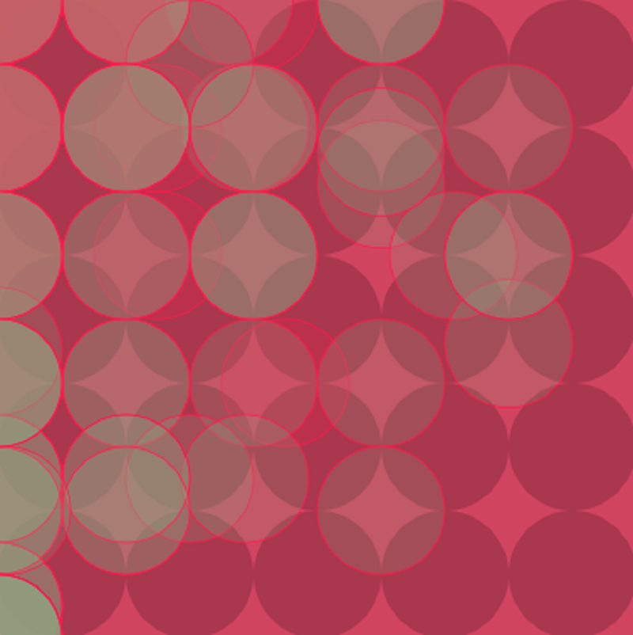
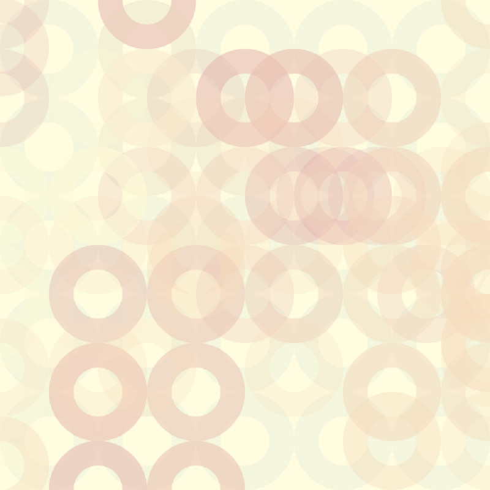

# Circles In Motion

项目网站、社交联系方式、项目介绍内容详见：https://opensea.io/collection/circles-in-motion

Genart.Ai 是 Phosus.com 的一个项目。在过去的 3 年中，我们一直与一些最好的创意社区合作，并为 Pixlr 等创意工具提供支持；世界排名第一的在线图像编辑工具。我们简化了创建您的风格、您的 NFT 的过程。

我们的团队不断致力于其他具有数十亿数据点和数亿图像的 AI 项目，以创建和预测未来的设计。我们还与几个顶级编辑工具合作，将 GenArt 整合到 SAAS 中。

我们一直与大学和人工智能研究中心密切合作，创造未来的艺术。从 NFT 获得的版税的 25% 将捐赠给大学。GenArt 从二次销售中收取 10% 的版税。我们希望支持更多的生成艺术开发人员和设计师。

社交媒体平台的未来将在元界上。Meta、微软和其他主要科技公司正在构建下一代社交和参与平台。GenArt 将探索我们的画廊并将其构建到他们的元宇宙中，以使我们的 NFT 所有者能够展示和交易他们的收藏。

GenArt 通过与一些图库照片库的合作与数十万艺术家合作。我们有技术研究他们的风格，然后根据他们的作品创作艺术。联系我们一起工作。

下一步将是建立一个专注于获取 Generative Art NFT 的 DAO。GenArt NFT 的所有者将获得对 GenArt DAO 做出的关键决策具有治理权的代币。

