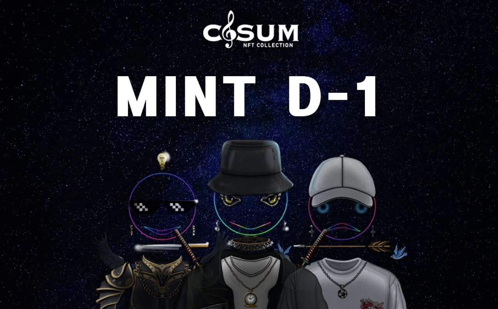
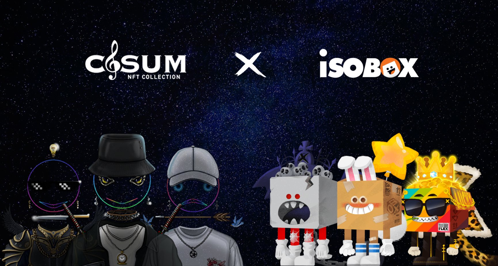
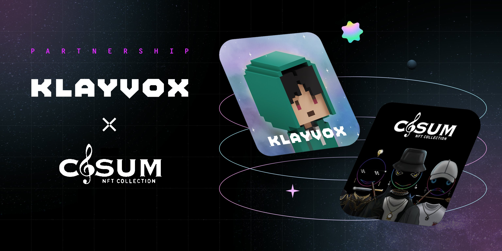

# CISUM OFFICIAL

项目网站、社交联系方式、项目介绍内容详见：https://opensea.io/collection/cisum-official

CISUM 是第一个 NFT MUSIC ART COLLECTION 项目，通过人工智能程序将 NFT 艺术与 8,888 首丰富多彩且独特的音乐相结合。

我们通过人工智能程序为您提供与现有作品不同的新艺术和价值，以及丰富多彩和独特的艺术。这是一个长期项目，通过提供一个平台，通过用户之间的故事讲述，通过自己的社区，积极区分和增加每种艺术的独特性，从而不断构建和发展 CISUM 的生态系统。

只有拥有的 CISUM 角色（包括名称和故事）才具有知识产权并且可以免费用于商业用途。

