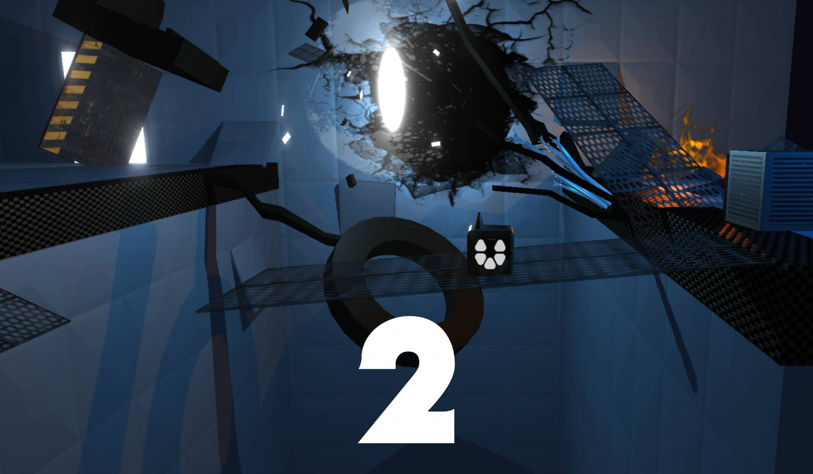
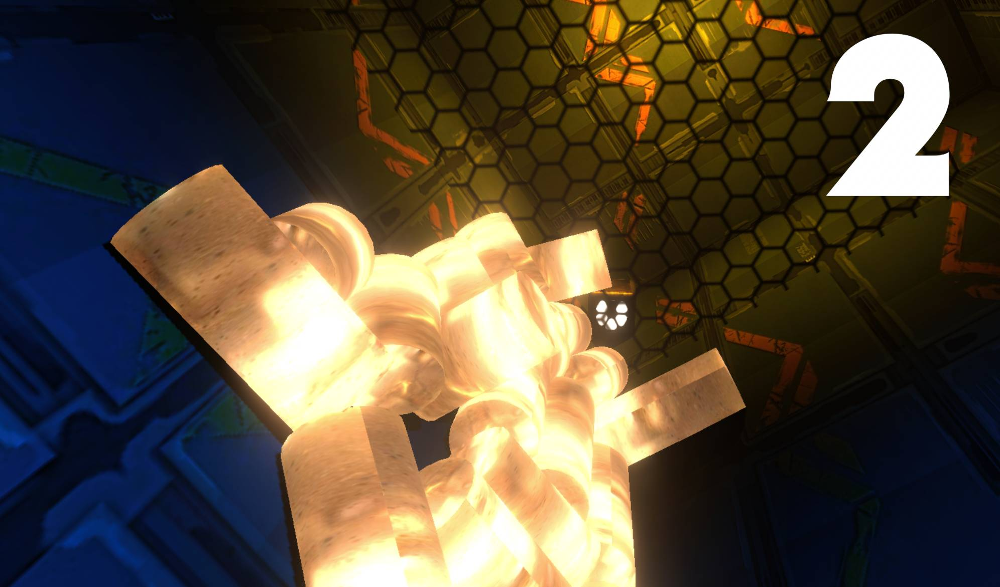
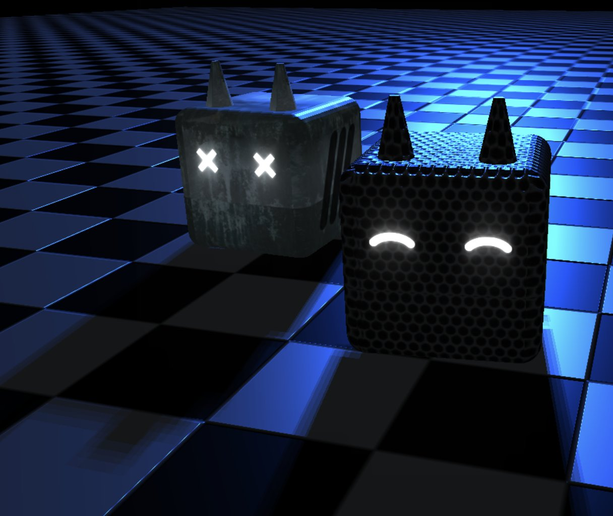

# Citadel NFT

项目网站、社交联系方式、项目介绍内容详见：https://opensea.io/collection/citadel-nft

一款 3D 冒险解谜游戏。可玩的 NFT 角色。一个值得探索的世界。
万年过去。雷击使舰船计算机终于苏醒。唯一能发挥作用的机械装置是一个低级的服务机器人。六边形。
计算机发出命令：前往地球并进行探索，以发现可以让飞船返回家园的电源。
独一无二的游戏世界
复古的未来在您的浏览器中。Citadel NFT 是 CITADEL 3D 虚拟世界中的可玩角色。选择一个机器人，使用工具，探索世界并与其他 CITADEL 居民分享冒险。
物理沙箱 IDE
建立和分享您自己的地图。一个支持 3D 物理的沙盒，在您的浏览器中具有集成开发环境。添加生物、障碍物、谜题、奇怪的科幻机器、配乐和视觉效果。

