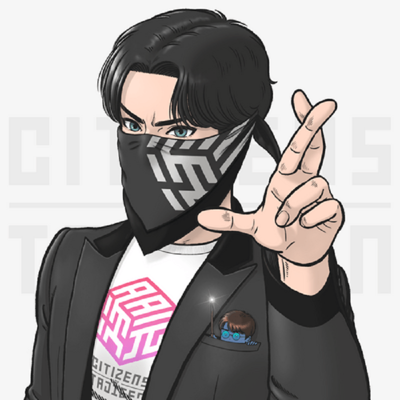
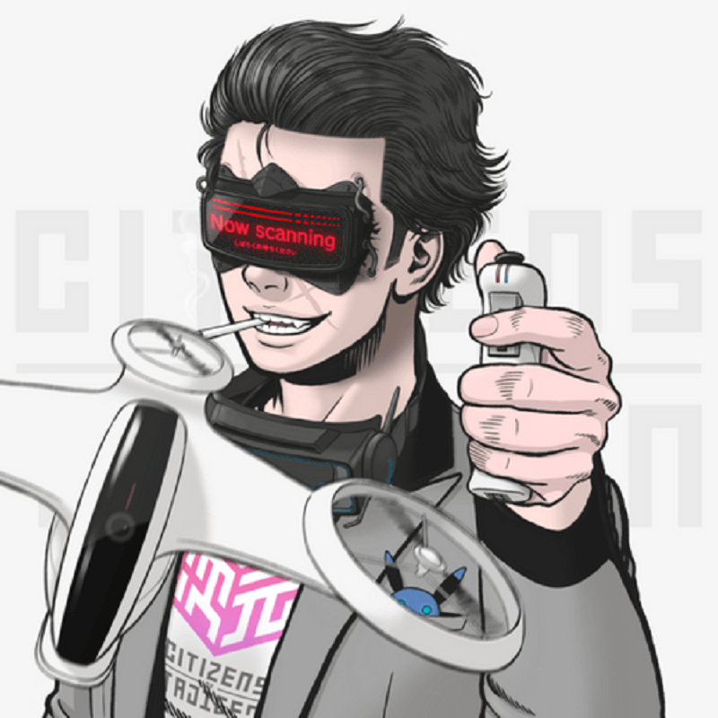

# Citizens Of Tajigen NFT Official Presale

项目网站、社交联系方式、项目介绍内容详见：https://opensea.io/collection/citizen-official-presale

Tajigen 公民是一个由匿名网络运行者组成的地下网络：艺术家、运动员、黑客、科学家和士兵，他们致力于实现一个共同目标：恢复权力下放并释放被困在新世界秩序中的人们。

以数字方式代表自己作为 Tajigen 公民，可以充分说明您和您的信仰。这是一个会意的眼神，一个帽子的尖端，一个秘密的握手，它说：我们在这里建立尽可能好的未来。

Tajigen 持有者可以进入 The Shelter：一个由处于 web3 和 DeFi 前沿的创始人、建设者、设计师和开发人员组成的独家中心，并访问我们概念图中概述的未来体验。

我们是 TinyERC721 的创造者，这是一个超 gas 优化的 NFT 合约。

