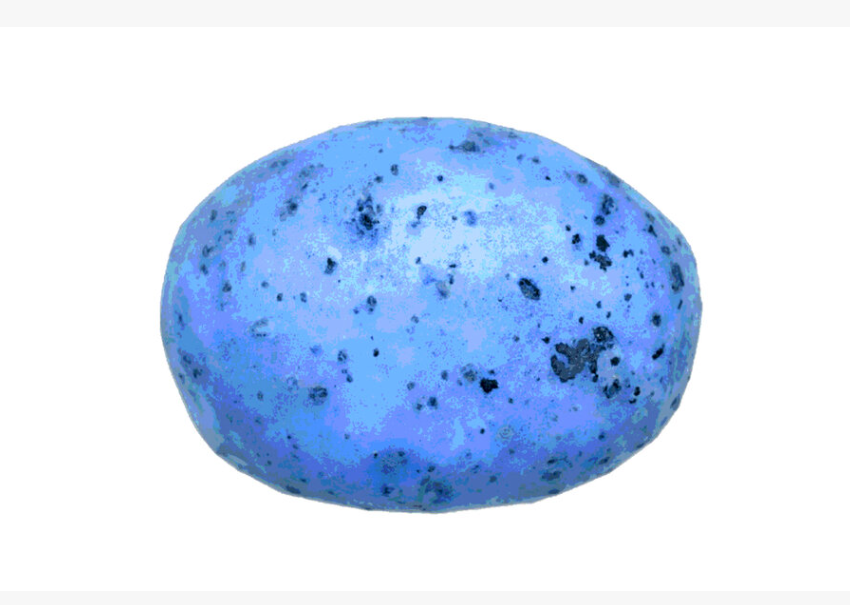
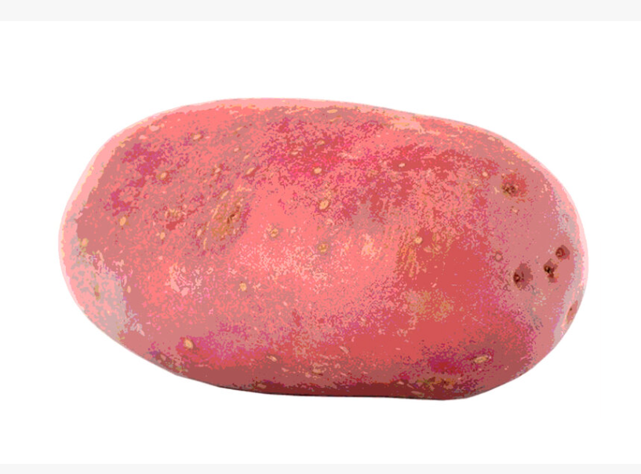
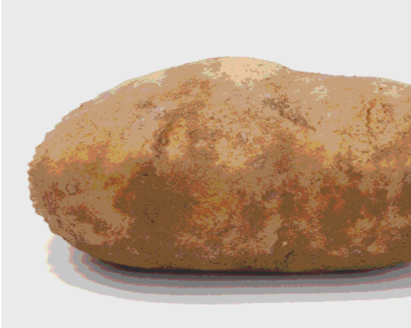

# POTATOES

项目网站、社交联系方式、项目介绍内容详见：https://opensea.io/collection/citizen

就 NFT 艺术而言，The People's Potato是一键式土豆泥。这是一种故意低效、低质量的 NFT。这就是使它成为一件精美的垃圾艺术的原因。但它远不止于此！
2020 年 7 月，我铸造了 10 亿个这样的代币 -受 Twitter 对话的启发- 并继续以 0,0001 ETH 的价格出售它们，作为挑战加密艺术中稀有性和稀缺性理想的实验。在全部售出之前，它们将始终保持该价格。
当时我没有意识到的是，我做了一个事实上可替代的 NFT（想想看）和伪社交货币。
随着时间的推移，人民马铃薯模因地成长起来。许多致敬、混音和模因是由其他艺术家创作的。
最终，它成为 TATR 技术创新的社会流动性挖掘协议（正在申请专利）中的关键组件，该协议使用 $TATR 社交代币将 DeFi 和 NFT 连接起来。
它继续入围2020 年最具创新性的 NFT，并最终获得人民选择奖。

