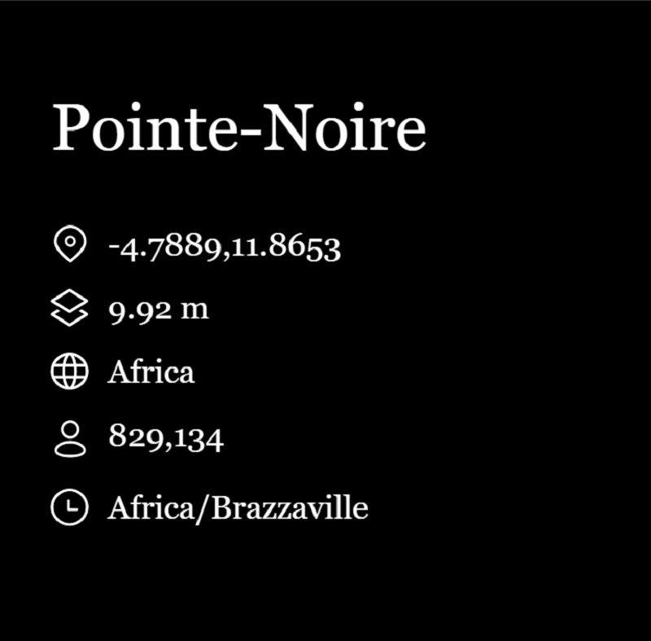
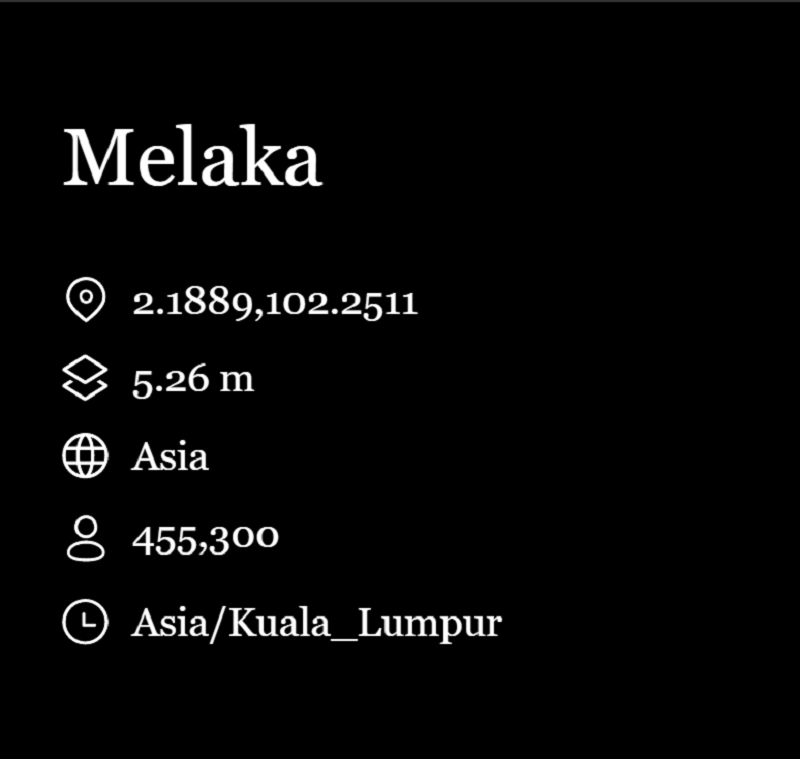

# Cityverse

项目网站、社交联系方式、项目介绍内容详见：https://opensea.io/collection/cityverse

▶ 什么是城市宇宙？
Cityverse 是一个 NFT（不可替代代币）集合。存储在区块链上的数字艺术品集合。
▶ 有多少 Cityverse 代币？
总共有 1,061 个 Cityverse NFT。目前，719 位车主的钱包中至少有一个 Cityverse NTF。
▶ 最近卖出了多少个 Cityverse？
过去 30 天内售出 0 个 Cityverse NFT。

