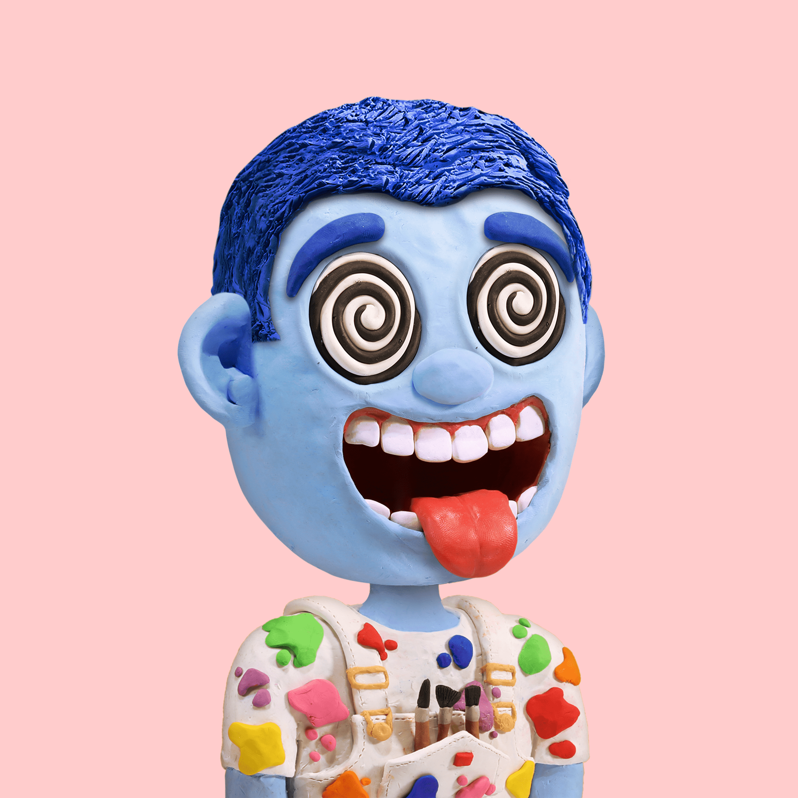

# Clay Friends

世界著名的定格动画师 Trent Shy 很高兴推出 Clay Friends，这是一个由 100% 真正粘土制成的 5000 件生成系列。 Clay Friends 将精心手工制作的艺术作品与独一无二的社区体验相结合，代表了 web3 和世界级艺术的统一。

什么是粘土朋友？
Clay Friends是一个NFT（不可替代令牌）集合。存储在区块链上的数字艺术品的集合。
▶ 有多少粘土朋友令牌存在？
总共有5，000个Clay Friends NFT.目前有2，417个所有者在他们的钱包中至少有一个Clay Friends NTF。
▶ 粘土朋友最昂贵的销售是什么？
最昂贵的Clay Friends NFT出售的是。它在2022-06-11（3个月前）以$ 671.8的价格出售。
▶ 最近卖了多少个粘土朋友？
在过去的30天内，有303个Clay Friends NFT售出。
▶ 粘土朋友多少钱？
在过去的30天里，最便宜的Clay Friends NFT销量低于80美元，最高的销量超过183美元。在过去的30天内，Clay Friends NFT的中位数价格为125美元。
▶ 什么是流行的粘土朋友替代品？
许多拥有Clay Friends NFT的用户也拥有Claylings，Zodiac Capsules，Theodoru和Boonji Project的SKULLOONS Gavroche。

