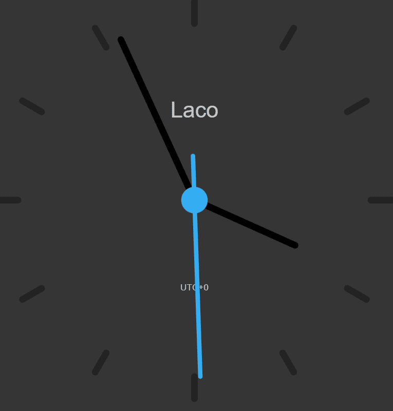

# Clock 8008

Clock8008 是您可以在元节中拥有的 8008 个功能时钟的集合。 Clock8008 以一丝不苟的细节精心打造，重新定义了虚拟世界中的计时，同时成为永恒的主打产品。

时钟 8008 NFT - 常见问题解答（FAQ）
▶ 什么是时钟 8008？
时钟 8008 是一个 NFT（不可替代令牌）集合。存储在区块链上的数字艺术品的集合。
▶ 有多少个时钟 8008 令牌存在？
总共有1，624个时钟8008 NFT.目前有434个所有者在他们的钱包中至少有一个时钟8008 NTF。
▶ 时钟 8008 最近售出了多少台？
在过去 30 天内售出了 0 个 Clock 8008 NFT。

