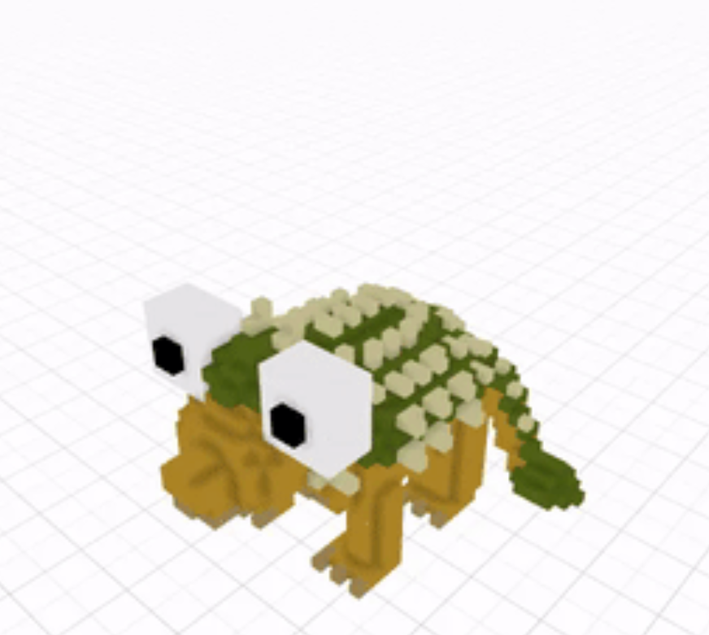

# Clods' Pet

项目网站、社交联系方式、项目介绍内容详见：https://opensea.io/collection/clodspet

土块的宠物不过是我土块的想象中的居民。在自然界中，我们有不同的动物居住在各个大陆上，即使在土块上，我们也有不同的动物，具体取决于土块。像旧星球的所有动物一样，甚至那些土块也进化到适应各种情况。它们的突变通常是由于污染而发生的。他们吃、喝或呼吸的东西会改变他们的习惯，从而改变他们的身体。这些宠物虽然很好，而且描述时经常会让人流泪，但从我的角度来看，它们处理的问题代表了我们。它们处理污染、社会关系等。我建议在看宠物时，超越简单的表现形式，想象它们背后的东西。

Clods 的宠物有几个稀有度：超级稀有、稀有、罕见和普通。

