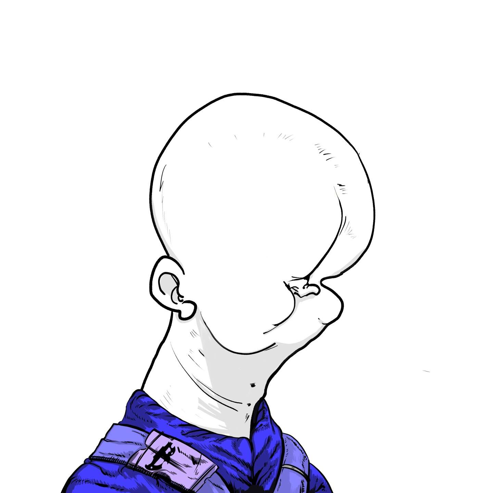

# Clones Never Die Asset

2SSUL 的 CxNxD 漫画

一开始独自存在的神，直接将自己的身体劈开，重生为101个外表和身份各异的克隆人。

然而，与建设一个多元思想共存的国家的初衷相反，
101个不同品味、不同意识形态的克隆人未能达成共识，
决定各自建立一个国家。

故事开始于一支由10，000名下层克隆人组成的军队，他们通过交换101名克隆人的神力来建立他们的星球。

关于《克隆人永不死的国王》
“Clones Never Die K”是“Clones Never Die”的版本1。
“CxNxD K”存在于klaytn区块链上。
CxNxD 原始集合的 100 个克隆已转移到 Polygon。
它是用一个名为Clones Never Die Kings的系列制作的。
每个克隆人都是克隆世界之王，并被命名。
此外，黑色框架附加到现有的原始收藏图片上。

