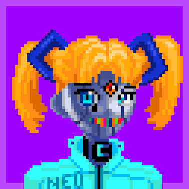

# ClonesPx

项目网站、社交联系方式、项目介绍内容详见：https://opensea.io/collection/clonespx

5,500 个手绘 NFT。RTFKT CloneX 的复古艺术诠释。用作元节的角色虚拟化的下一代化身。不隶属于 RTFKT。

DNA中有一种病毒可以使化身像素化。
所有都是独一无二的，包括新的特征，由我们的艺术家 Hoshi Koshin 手绘

将有10个动画传奇。这些是 1/1。
分配将在赠品和拍卖之间分配

