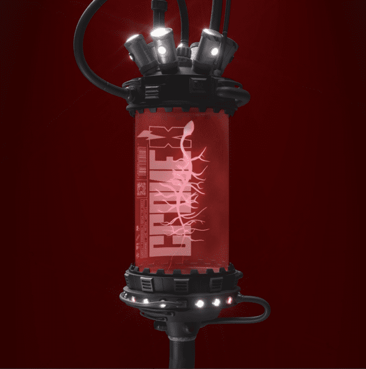

# RTFKT - CloneX Mintvial

薄荷小瓶用于兑换克隆 X 头像。 1 个薄荷小瓶 = 1 个随机克隆。

什么是RTFKT - CloneX Mintvial？
RTFKT - CloneX Mintvial是一个NFT（不可替代令牌）集合。存储在区块链上的数字艺术品的集合。
▶ 有多少个RTFKT - CloneX Mintvial令牌存在？
总共有354个RTFKT - CloneX Mintvial NFT.目前有344个所有者在他们的钱包中至少有一个RTFKT - CloneX Mintvial NTF。
▶ 什么是最昂贵的RTFKT - 克隆X微型销售？
最昂贵的RTFKT - CloneX Mintvial NFT出售的是CLONE X MINT VIAL 🧪。它于2022-06-17（3个月前）以$ 79k的价格出售。
▶ 最近售出了多少个RTFKT - CloneX Mintvial？
在过去的30天内，有31个RTFKT - CloneX Mintvial NFT售出。
▶ RTFKT - CloneX Mintvial的成本是多少？
在过去的30天里，最便宜的RTFKT - CloneX Mintvial NFT销量低于15.8万美元，最高销售额超过24.4万美元。RTFKT - CloneX Mintvial NFT的中位价格是过去30天内的17000美元。
▶ 什么是流行的RTFKT - CloneX Mintvial替代品？
许多拥有RTFKT - CloneX Mintvial NFT的用户也拥有Champion x Non-Fungible People，X-Bot，LOOT POD DECOR [POLYGON]和R66 Toys。

