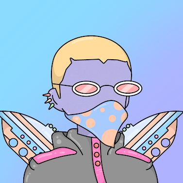
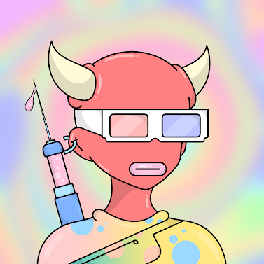
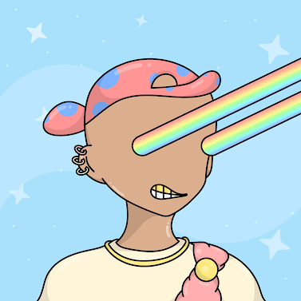

# Cloodle - Z

项目网站、社交联系方式、项目介绍内容详见：https://opensea.io/collection/cloodlezofficial

欢迎来到 Cloodleverse！Cloodle-Z 是一组独特的数字收藏涂鸦克隆。Cloodles 由各种 DNA、服装、配饰、颜色、眼睛、背部、上衣和背景组成。它们生活在以太坊区块链上，每一个都是独特的不可替代令牌（NFT）。Cloodle - Z 是一个 NFT（不可替代代币）集合。存储在区块链上的数字艺术品集合。总共有 542 个 Cloodle - Z NFT。目前，287 位车主的钱包中至少有一个 Cloodle - Z NTF。

##### 

