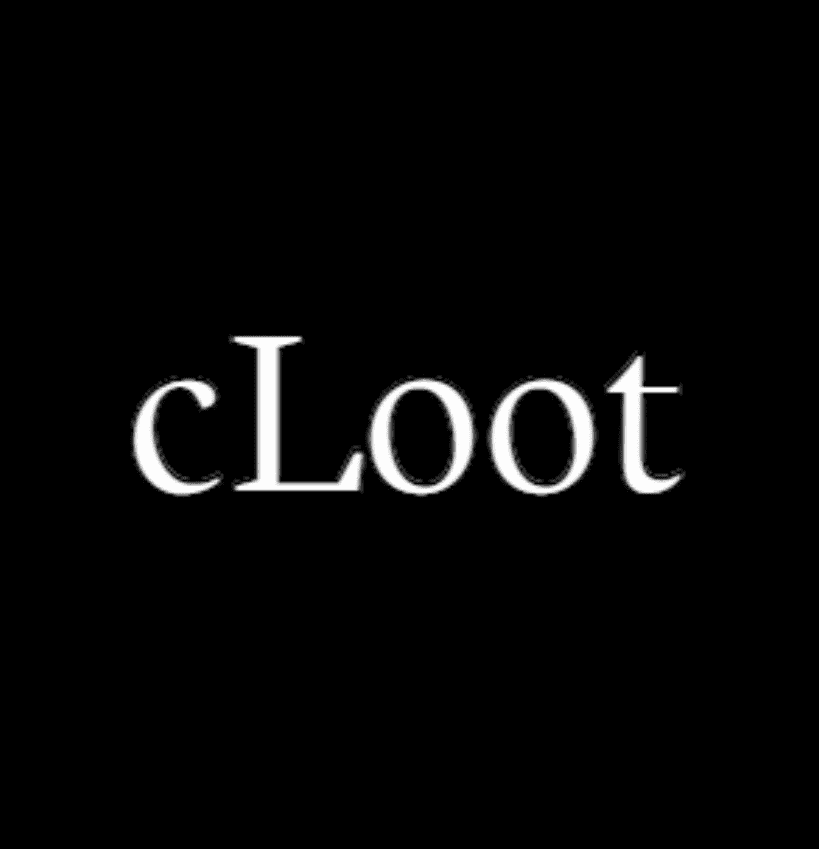

# cLoot (for Chinese Adventurers)

cLoot 是中文描述的随机生成并存储在链上的冒险家装备。 统计数据、图像和其他功能被刻意省略以供其他人解释。 您可以以任何您想要的方式使用 cLoot。 

什么是cLoot（中国冒险家）？
cLoot（中国冒险家）是一个NFT（不可替代的令牌）集合。存储在区块链上的数字艺术品的集合。
▶ 有多少cLoot（中国冒险家）代币存在？
总共有2，454个cLoot（中国冒险家）NFT.目前有1，201个所有者在他们的钱包里至少有一个cLoot（中国冒险家）NTF。
▶ 最近卖了多少cLoot（中国冒险家）？
在过去的30天内，有0 cLoot（针对中国冒险家）NFT售出。

