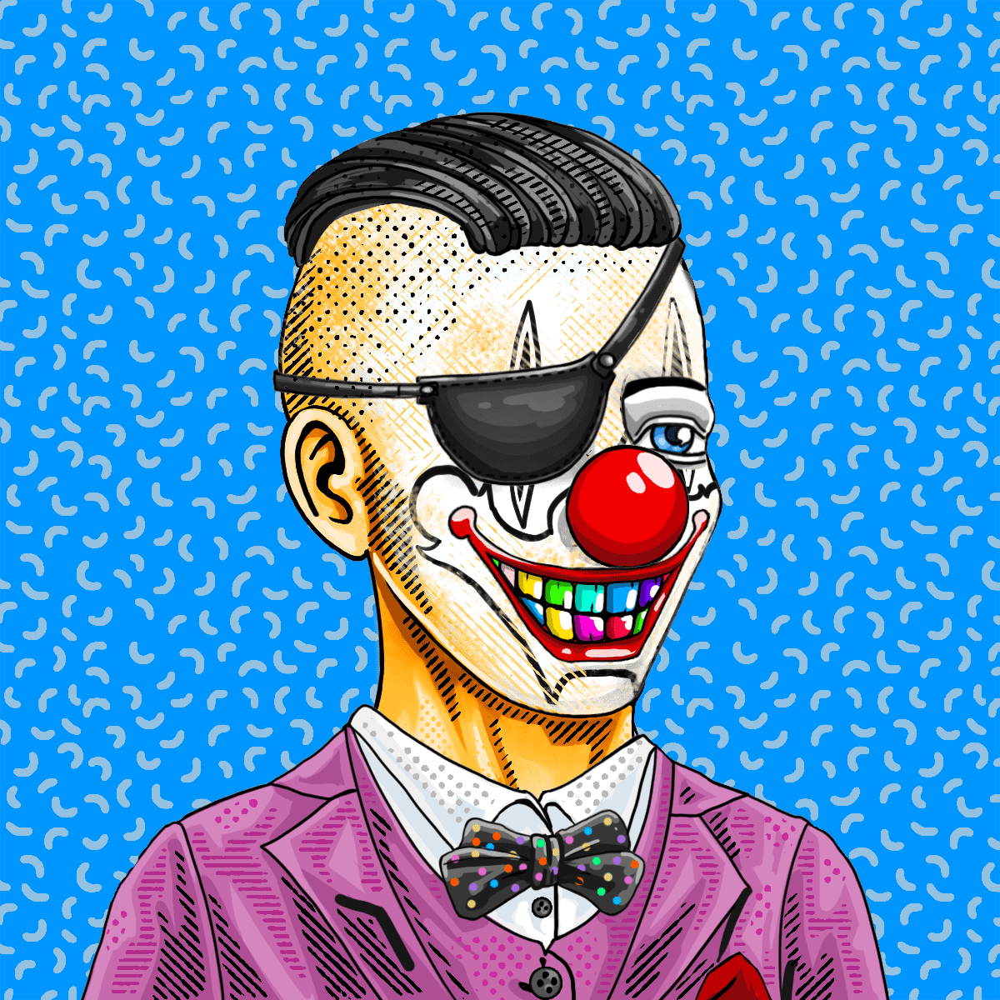

# The Clown Squad

介绍小丑小队，由 7,777 名小丑组成的集合，他们从流放归来，准备在虚拟世界中造成严重破坏和混乱。

什么是小丑小队？
小丑小队是NFT（不可替代令牌）的集合。存储在区块链上的数字艺术品的集合。
▶ 小丑小队有多少个代币存在？
总共有7，776个小丑小队NFT.目前有2，138名所有者在他们的钱包里至少有一个小丑小队NTF。
▶ 最昂贵的小丑小队销售是什么？
最昂贵的The Clown Squad NFT是Clown Squad #7459。它在2022-06-25（2个月前）以$ 340.3的价格出售。
▶ 最近卖了多少小丑小队？
在过去的30天内，有6，559个小丑小队NFT售出。
▶ 小丑小队多少钱？
在过去的30天里，最便宜的The Clown Squad NFT销量低于4美元，最高的销量超过46美元。在过去的30天里，小丑小队NFT的中位数价格为10美元。
▶ 小丑小队的热门替代品是什么？
许多拥有小丑小队NFT的用户也拥有boolishbunnies.wtf，Candy Robbers，Serious Investor和Monkerunners Official。

