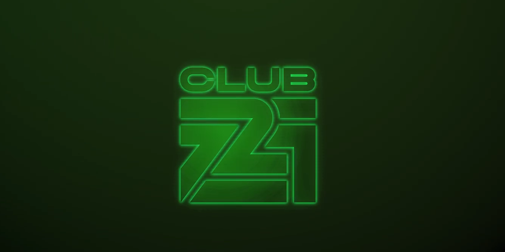

# Club721 welcome you

项目网站、社交联系方式、项目介绍内容详见：https://opensea.io/collection/club721-welcome-you

什么是 Club721？
Club721 是一个 NFT（非同质代币）集合。存储在区块链上的数字艺术品集合。
有多少个 Club721 代币？
总共有 1,961 个 The Club721 NFT。目前，1,756 位车主的钱包中至少有一个 The Club721 NTF。
最贵的 The Club721 销售是什么？
最昂贵的 Club721 NFT 是 Club721 Membership。它于 2022-08-02（26 天前）以 53.5 美元的价格售出。
The Club721 最近卖出了多少？
过去 30 天内售出了 17 个 The Club721 NFT。
Club721 的价格是多少？
过去 30 天，最便宜的 The Club721 NFT 销售额低于 28 美元，最高销售额超过 49 美元。过去 30 天，The Club721 NFT 的中位价格为 35 美元。

