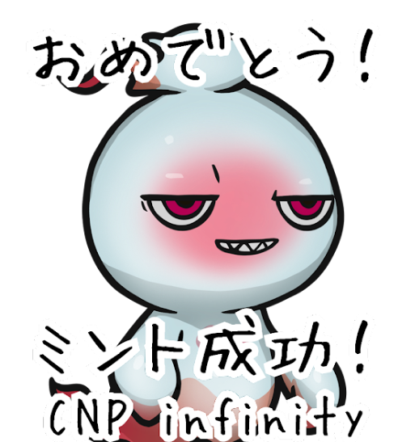

# CryproNinja Partners Infinity

项目网站、社交联系方式、项目介绍内容详见：https://opensea.io/collection/cnpi

什么是 CryptoNinja 合作伙伴？
CryptoNinja Partners 是一个 NFT（不可替代令牌）集合。存储在区块链上的数字艺术品集合。
有多少 CryptoNinja Partners 代币？
总共有 22,222 个 CryptoNinja Partners NFT。目前，4,777 位所有者的钱包中至少有一个 CryptoNinja Partners NTF。
最昂贵的 CryptoNinja Partners 销售是什么？
售出的最昂贵的 CryptoNinja Partners NFT 是 Leelee-Rainbow01 #08569。它于 2022 年 6 月 17 日（2 个月前）以 4.4 万美元的价格售出。
最近卖出了多少 CryptoNinja 合作伙伴？
过去 30 天内共售出 2,961 个 CryptoNinja Partners NFT。
CryptoNinja 合作伙伴的费用是多少？
在过去 30 天里，最便宜的 CryptoNinja Partners NFT 销售额低于 288 美元，最高销售额超过 849 美元。CryptoNinja Partners NFT 的中位价格在过去 30 天内为 455 美元。

