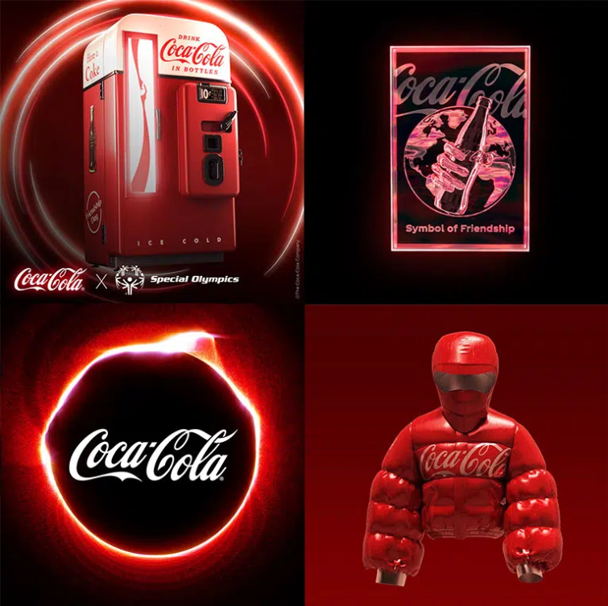

# Coca Cola Official

项目网站、社交联系方式、项目介绍内容详见：https://opensea.io/collection/coca-cola-official-nfts

可口可乐正在通过其首个 NFT（非同质代币）收藏品提升其在快速增长的虚拟世界中的影响力。在 7 月 30 日国际友谊日，四个独特的可口可乐 NFT 将作为一个“战利品盒”通过 OpenSea 在线市场进行拍卖。

“可口可乐品牌在历史上一直在流行文化中发挥着积极、真实的作用，”可口可乐商标全球高级品牌总监 Oana Vlad 说。“我们一直在关注 NFT、加密货币和元界，并认为这是参与这一新兴领域并向其学习的适时机会。国际友谊日是一个绝佳的机会，可以通过独特的可口可乐方式将人们虚拟地聚集在一起，同时为我们在特奥会上 53 年的亲密朋友筹集资金。”

