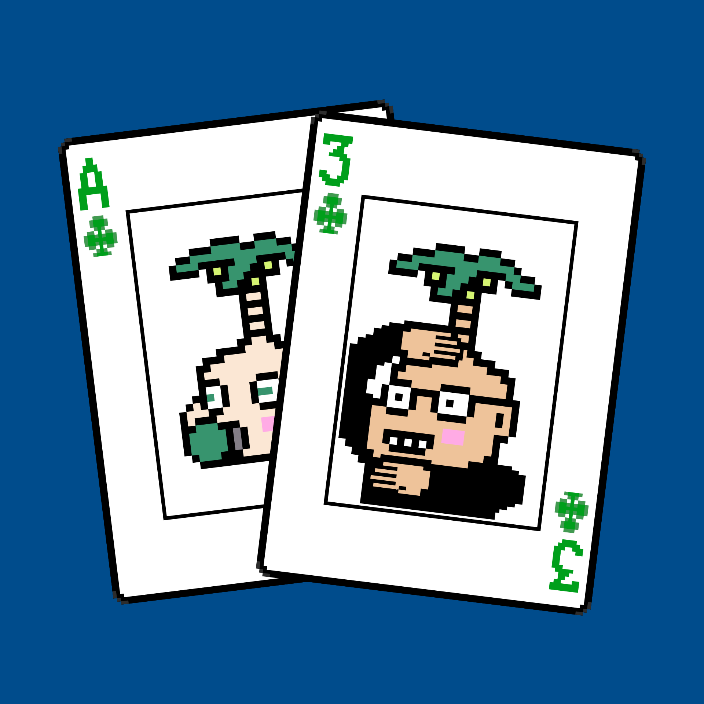

# CoconutsBabyPoker

项目网站、社交联系方式、项目介绍内容详见：https://opensea.io/collection/coconutsbabypoker

你好世界。我们今天刚刚推出了一个新的 NFT 艺术收藏“椰子宝宝扑克”！！

什么是 CoconutsBabyPoker？
CoconutsBabyPoker 是一个 NFT（Non-fungible token）集合。存储在区块链上的数字艺术品集合。
CoconutsBabyPoker 代币有多少？
总共有 30 个 CoconutsBabyPoker NFT。目前，15 位所有者的钱包中至少有一个 CoconutsBabyPoker NTF。
最近卖出了多少 CoconutsBabyPoker？
过去 30 天内共售出 0 个 CoconutsBabyPoker NFT。

