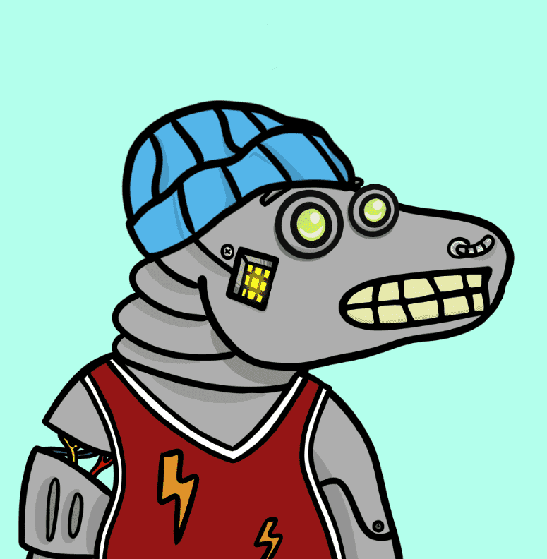

# CoCoVerse Official

CoCoVerse 官方 NFT 在过去 7 天内售出 2 次。CoCoVerse Official 的总销售额为 0 美元。一份 CoCoVerse 官方 NFT 的平均价格为 0 美元。共有 595 名 CoCoVerse 官方所有者，总共拥有 2,222 个代币。

欢迎来到 CoCoVerse，2,222 只手绘科莫多巨蜥生活在元宇宙中。

CoCoVerse 官方 NFT - 常见问题（FAQ）
▶ 什么是 CoCoVerse 官员？
CoCoVerse Official 是一个 NFT（非同质代币）集合。存储在区块链上的数字艺术品集合。
▶ CoCoVerse 官方代币有多少？
总共有 2,222 个 CoCoVerse 官方 NFT。目前，595 位所有者的钱包中至少有一个 CoCoVerse 官方 NTF。
▶ 最昂贵的 CoCoVerse 官方促销是什么？
出售的最昂贵的 CoCoVerse 官方 NFT 是 CoCoVerse #235。它于 2022 年 6 月 30 日（2 个月前）以 0 美元的价格出售。
▶ 最近卖出了多少 CoCoVerse Official？
过去 30 天内售出了 2 个 CoCoVerse 官方 NFT。
▶ 什么是流行的 CoCoVerse 官方替代品？
许多拥有 CoCoVerse 官方 NFT 的用户还拥有 My Pet Ghosts、 BraveBears、 PillowCats (Eth)和 BillionaireSkullClub。

