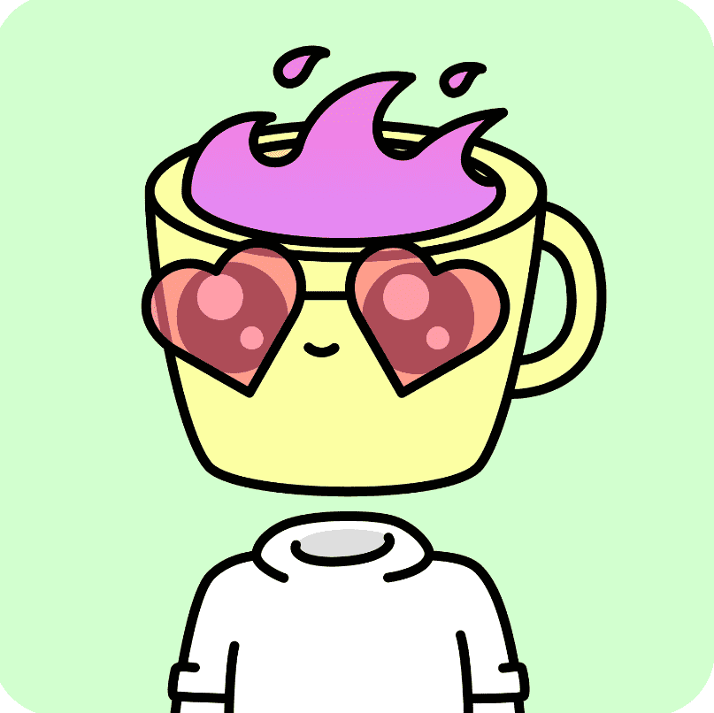

# Coffee Club Official

你能闻到咖啡的味道吗？

咖啡俱乐部是一个社区驱动的 NFT 集合，包含独特的马克杯头像。每个 Cup 都是独一无二的，并且作为 ERC-721 令牌存在于以太坊区块链上。

我们的目标是在世界上形成最大的疯狂咖啡爱好者社区。

Coffee Club 官方 NFT 在过去 7 天内售出 3 次。Coffee Club Official 的总销售额为 15.37 美元。一份 Coffee Club Official NFT 的平均价格为 5.1 美元。共有 1,094 名 Coffee Club 官方所有者，总供应量为 3,000 个代币。

咖啡俱乐部官方 NFT - 常见问题（FAQ）
▶ 什么是咖啡俱乐部官员？
Coffee Club Official 是一个 NFT（Non-fungible token）集合。存储在区块链上的数字艺术品集合。
▶ 咖啡俱乐部官方代币有多少？
总共有 3,000 个 Coffee Club 官方 NFT。目前，1,094 位业主的钱包中至少有一份 Coffee Club Official NTF。
▶ 最贵的咖啡俱乐部官方促销是什么？
售出的最昂贵的 Coffee Club Official NFT 是 Cup #1214。它于 2022-06-15（3 个月前）以 89.6 美元的价格售出。
▶ 最近卖出了多少咖啡俱乐部官方？
过去 30 天内售出了 10 个 Coffee Club 官方 NFT。
▶ 什么是流行的 Coffee Club Official 替代品？
许多拥有 Coffee Club Official NFT 的用户还拥有 Knights of Chain、 CryptoCelestials、 Wicked Craniums Comic和 NFT Siblings Avatars。

