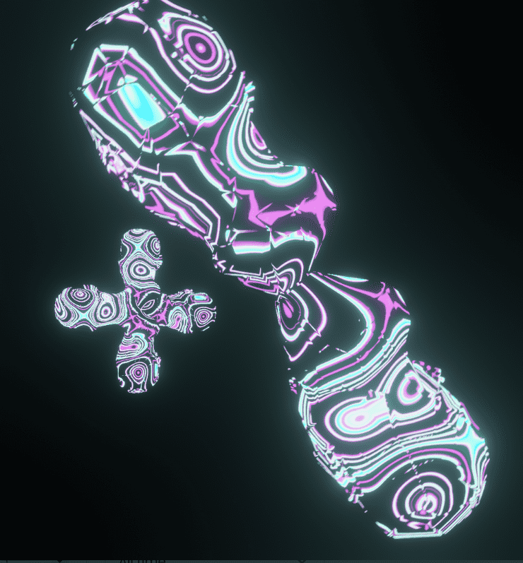

# collabTAPE

良好社会第 3 卷是从记录的一端到另一端的旅程。 一年前，他们开始与真正发明了自己的舞台角落的艺术家一起创作终极嘻哈和电子专辑。 我们现在通过 web3 发布这个多样化的歌曲集，以代表艺术家无边界创作时可能出现的所有旋律制作、独特的编排和抒情流。

collabTAPE NFT - 常见问题（FAQ）
▶ 什么是 collabTAPE？
collabTAPE 是一个 NFT（非同质代币）集合。存储在区块链上的数字艺术品集合。
▶ 有多少 collabTAPE 代币？
总共有 15 个 collabTAPE NFT。目前，1,395 位所有者的钱包中至少有一个 collabTAPE NTF。
▶ 最近卖出了多少 collabTAPE？
过去 30 天内共售出 0 个collabTAPE NFT。

