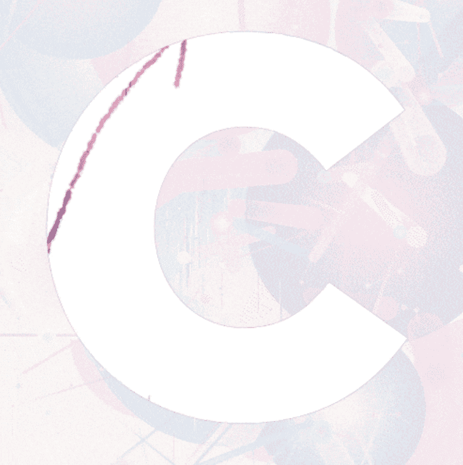

# Collective 168

星座 - 一组生成艺术，展示了如果行星和恒星由其他形状组成，我们的夜空会是什么样子。 它开始于一个简单的想法，如果恒星和行星的形状不总是球形怎么办？如果某些行星的形状像立方体怎么办？ 还是圆锥？ 还是字面上的星形？ 我们如何以艺术形式表达这种思想？ 浏览许多艺术家和他们的作品，以及在我的公寓里凝视着傍晚的天空，这给了我创作这个创世记的灵感。

集体168是一家加密
资产领域的媒体和技术公司，其目标是
从长远来看为我们的收藏家带来价值。我们的公用事业旨在
超越正常路线图的可持续性。

