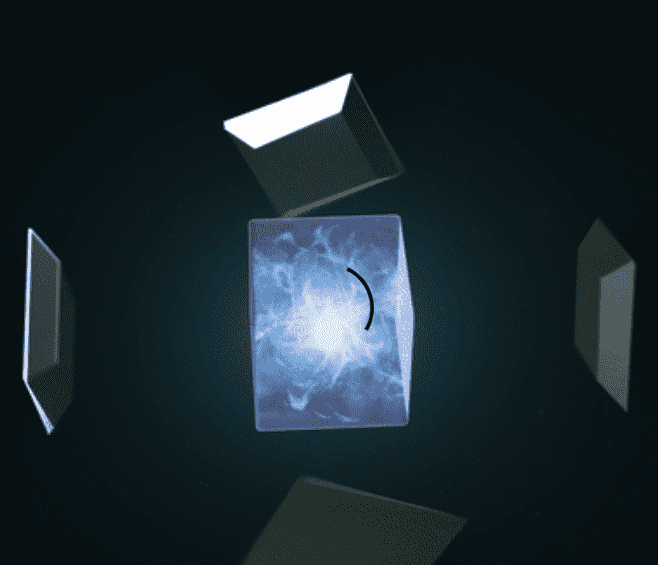

# COLLEXX SEED

COLLEXX 是世界上第一个连接物理和数字的 PHYGITAL NFT MARKETPLACE。 我们独特开发的 ESCROW 智能合约和 NFT 证书将允许安全透明的 P2P 交易。 持有我们的 SEED 有很多好处，包括获得独一无二的奖品。地球被摧毁，人类进入元宇宙。
在不久的将来，这个世界已经变成了我们无法再生存的地方。 地球被污染和破坏，它的寿命即将结束。 即便是辉煌的人类文明，也已经走到了尽头。 人类的残余运行着史无前例的地球再生计划“盖亚”。 大约需要 1000 年才能恢复被破坏的地球生态系统。

COLLEXX SEED NFT 在过去 7 天内售出 2 次。COLLEXX SEED 的总销售额为 186.63 美元。一份 COLLEXX SEED NFT 的平均价格为 93.3 美元。共有 781 个 COLLEXX SEED 所有者，总共拥有 5 个代币。

