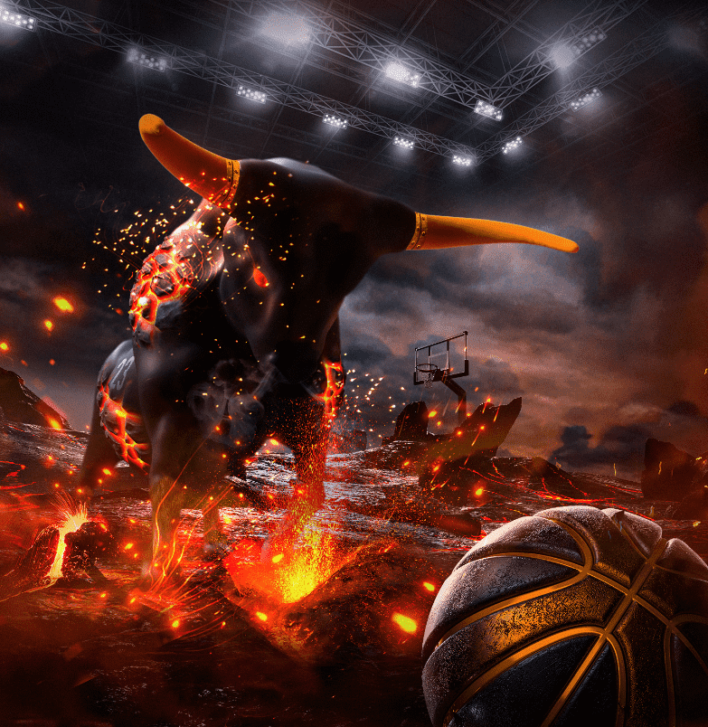

# collision.art

碰撞版本作为免费奖励分发给 Blokpax 社区。 Blokpax 不销售 Collision 版本。 Collision 是一个多艺术家合作，其中每个艺术版本都与一个实体制品相关联。 我们的实物文物将被拍卖为我们未来的生态系统实用代币 BPX。 然后，此 BPX 将按比例分配给 Collision 版本的持有者（然后他们可以在未来的拍卖或整个生态系统中自己使用 BPX）。 重要提示：BPX 在 Blokpax 生态系统中没有其他功能，并且不能从 Blokpax 购买。 Blokpax 不提供或打算提供 BPX 的二级市场。

我们相信艺术+资产的概念是收藏家会喜欢的。我们希望标志性基础资产的共同所有权能够与艺术建立更紧密的联系，并为所有版本持有者带来自豪感。

