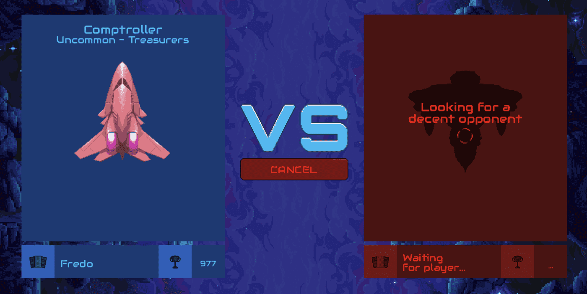

# Cometh Spaceships

Cometh 是一款由 DeFi 驱动的游戏，具有产生收益的 NFT。获得宇宙飞船，探索银河系并赚取代币。Cometh 创建在智能合约上端到端运行的区块链游戏，可轻松与 DeFi 协议集成Cometh Battle 是一款免费的战术纸牌游戏。玩家必须在战前战略性地结合宇宙飞船和甲板。Cometh 是一个 web3 游戏工作室，其使命是创建下一代区块链游戏并构建 B2B 解决方案，以推动区块链在视频游戏行业的采用。如果您还不熟悉纸牌游戏或 Cometh，这篇文章适合您！我们将介绍 Cometh Battle 的基本概念并描述不同类型的卡片和对新手来说可能过于复杂的单词。

