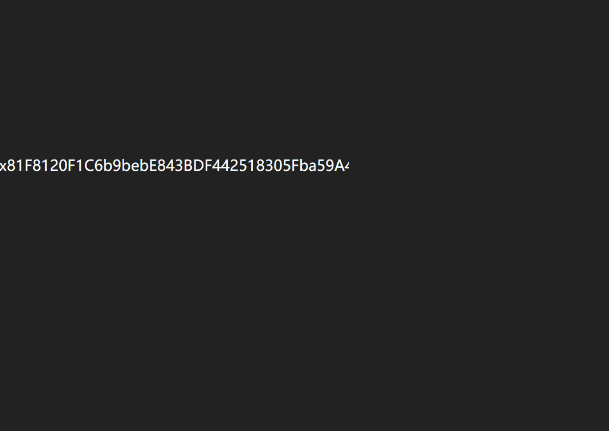

# Completely Pointless NFT

我做过的最无意义的事，因为现在似乎很流行（2021 年 9 月）
完全没有意义的 NFT NFT - 常见问题（FAQ）
▶ 什么是完全没有意义的 NFT？
Completely Pointless NFT 是一个 NFT（不可替代代币）集合。 存储在区块链上的数字艺术品集合。
▶ 有多少完全无意义的 NFT 代币？
总共有 969 个完全无意义的 NFT NFT。 目前 828 位所有者的钱包中至少有一个 Completely Pointless NFT NTF。
▶ 最近卖出了多少完全无意义的 NFT？
过去 30 天内售出了 0 个完全无意义的 NFT NFT。

