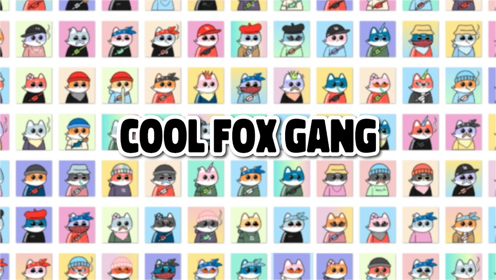

# Cool Fox Gang

5000 只狐狸，超过 +100 手工特征。如果您想购买未上市的，您可以发送报价为 0.003 - 第一个报价将被接受，不是最高的！ 稀有工具将在售出一半后添加。路线图：酷狐帮是 5,000 件手绘作品的集合，包含在多边形链中。 这是一段记忆，你可以将我们内心对动物的爱与 NFT 融为一体，并在我们身上留下永久的印记。 Cool Fox 拥有者可以参与 NFT 征集、抽奖、社区赠品等特殊活动。 这是一组 NFT 字符，我们可以通过酷狐狸识别出我们对动物的爱。 我们的路线图或目标是通过将我们的部分收入（最多 50%）用于购买过程来支持即将到来的新艺术家。

酷狐帮 NFT - 常见问题（FAQ）

▶ 什么是酷狐帮？

Cool Fox Gang 是一个 NFT（Non-fungible token）集合。存储在区块链上的数字艺术品集合。

▶ Cool Fox Gang 代币有多少？

总共有 4,999 个 Cool Fox Gang NFT。目前，63 位车主的钱包中至少有一个 Cool Fox Gang NTF。

▶ 酷狐帮最近卖了多少？

过去 30 天内共售出 0 个 Cool Fox Gang NFT。

