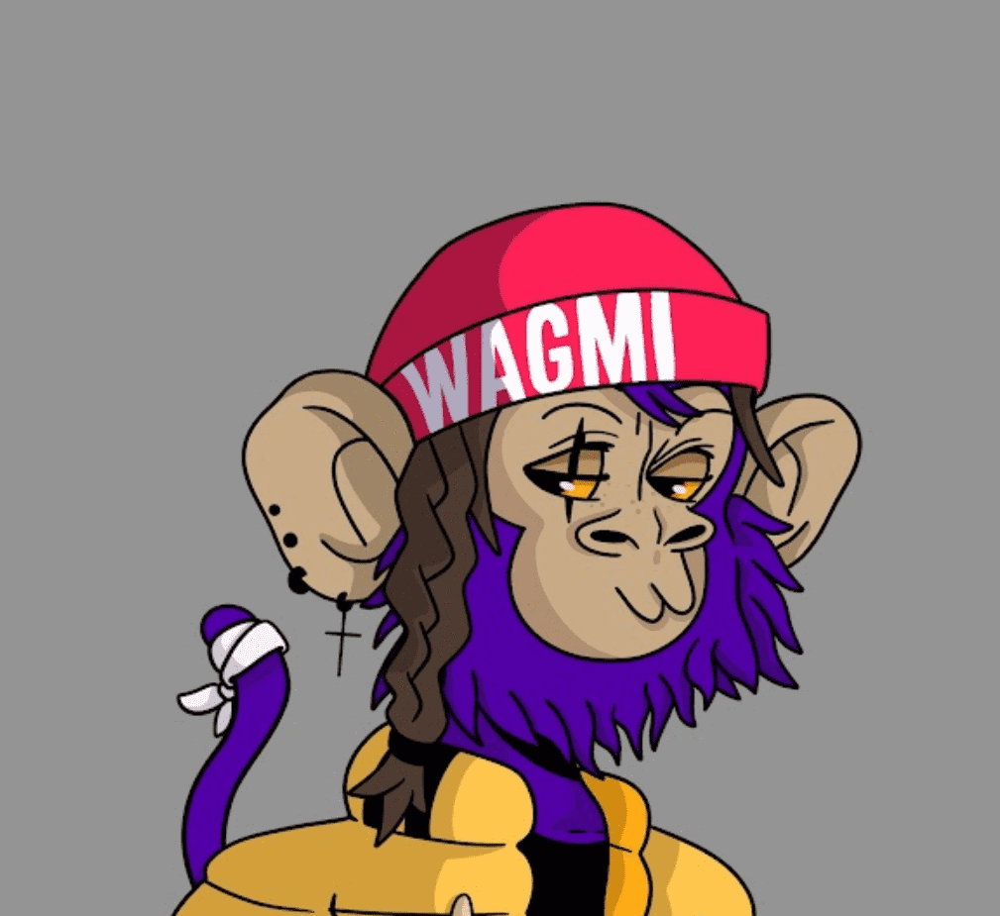

# Cool Kidz Club

Cool Kidz Club NFT - 常见问题（FAQ）
▶ 什么是酷儿童俱乐部？
Cool Kidz Club 是一个 NFT（Non-fungible token）集合。存储在区块链上的数字艺术品集合。
▶ 有多少 Cool Kidz Club 代币？
总共有 5,555 个 Cool Kidz Club NFT。目前，1,480 位车主的钱包中至少有一个 Cool Kidz Club NTF。
▶ Cool Kidz Club 最贵的促销是什么？
最贵的 Cool Kidz Club NFT 是 Cool Kid 676。它于 2022-06-23（2 个月前）以 4.4 美元的价格售出。
▶ Cool Kidz Club 最近卖出了多少？
过去 30 天内售出了 2 个 Cool Kidz Club NFT。
▶ 什么是流行的 Cool Kidz Club 替代品？
许多拥有 Cool Kidz Club NFT 的用户还拥有 MADworld X B.Duckling、 HPPRS GIFT SHOP、 Zombie Ape和 Weird Kitties。

