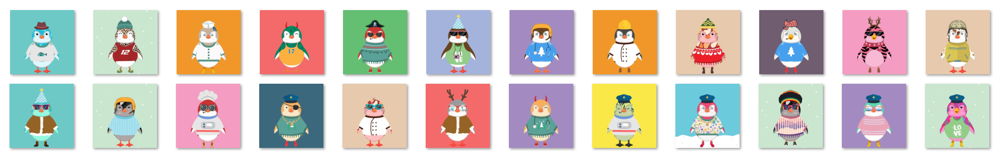

# Cool Penguins

10,000 只用于区块链的转基因企鹅。 有些人戴帽子，有些人穿毛衣，有些人甚至抽烟！

酷企鹅 NFT - 常见问题（FAQ）过去 7 天没有售出酷企鹅。

▶ 什么是酷企鹅？

Cool Penguins 是一个 NFT（Non-fungible token）集合。存储在区块链上的数字艺术品集合。

▶ 酷企鹅代币有多少？

总共有 466 个酷企鹅 NFT。目前 137 位所有者的钱包中至少有一个 Cool Penguins NTF。

▶ 最近卖出了多少酷企鹅？

过去 30 天内共售出 0 个 Cool Penguins NFT。

