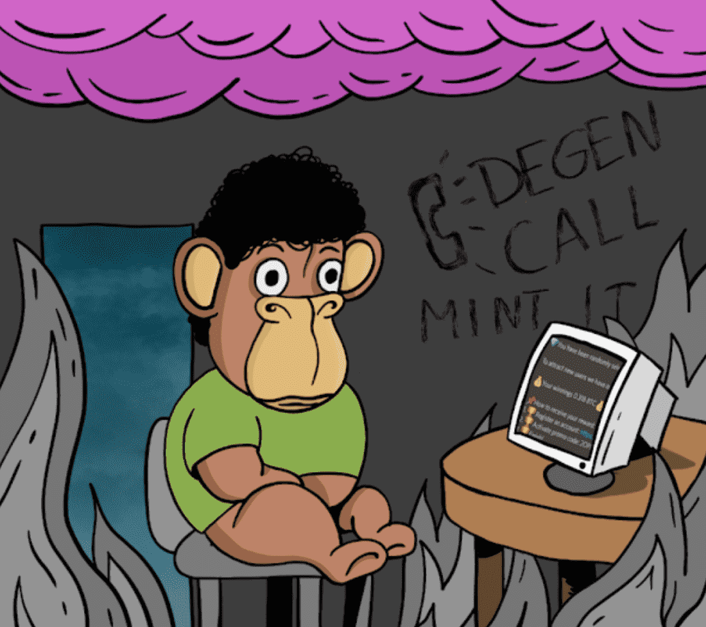

# Cope Ape

什么是 ERC 5050？
1. 第一个 NFT 保证免费。 只是他妈的freemint，因为每个人都喜欢。
2. 从第二个铸币厂开始，您有 50/50 的机会免费或付费铸币厂。 所以，你点击了上面的«Mint»按钮......
你滚动免费薄荷
1. 铸币金额将从钱包中扣除
2. 你收到你的 NFT
3. 智能合约将完整的铸币价格发回给你
例子：
您已经申请了免费的 nft，并且想要另一个。 你按下 MINT，在 Metamask 中你会看到每 NFT 将收取 0.0069 ETH 的价格。 交易通过后，你得到了NFT，你也拿回了0.0069 ETH（因为你是个幸运的混蛋）
你为付费薄荷滚动
好吧，0.0069 ETH 并不多，是吗，朋友？ 但请记住宇宙法则——当我们放弃某些东西时，我们会得到一些回报。 恭喜，真正的收藏家！

