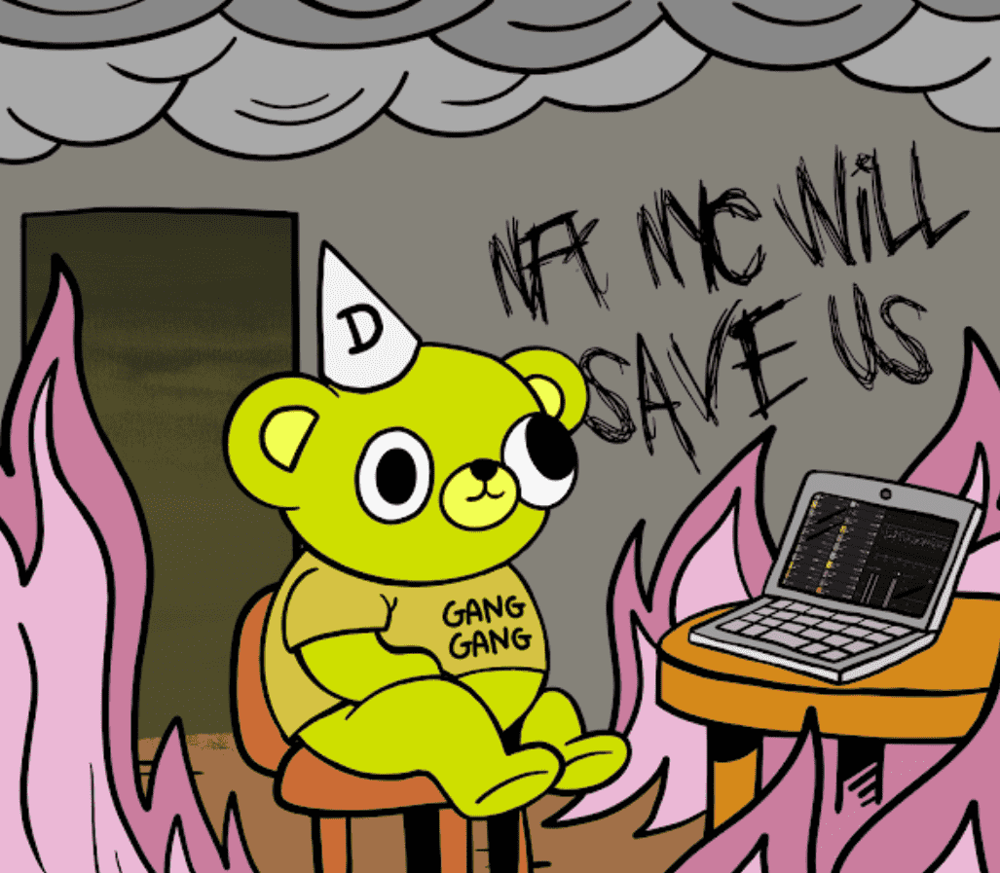

# CopeBears

共有 1,876 名 CopeBears 所有者，总共拥有 7,993 个代币。
1,770 人被烧毁，1,181 人被质押。
燃烧 $COPE 或 Stake 获得 $HOPE。
8000 只生活在以太坊区块链上的 Cope Bears 通过 ERC-5050 协议的首次实施铸造而成。
为什么要铸造这个狗屎？
你还要在这个市场上铸造什么他妈的，你degen？ 一切都在燃烧，但我们是为了艺术、模因和文化而来的——对吧？
也是 2022 年熊市的非官方 p-o-s（“生存证明”）。
每个钱包 5 个——别太贪心了。

