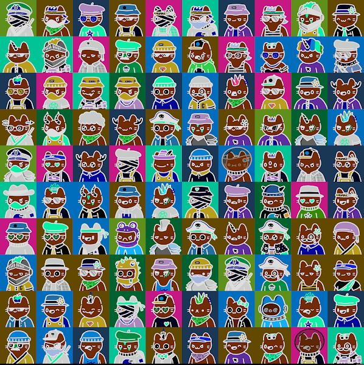

# CopyCatsNFT

以太坊区块链上有 9,999 只模仿猫。 从质押中赚取 $COPYCAT 并拥有一个分部 Cats Vault 的一部分。 所有者将对 DAO 的资产拥有投票权。 当前在 Snapshot 上进行的所有投票，其中 1 个复制猫 = 1 个投票。 访问 www.copycatsnft.co 了解更多信息。

酷猫网 NFT - 常见问题（FAQ）

▶ 什么是coolcatsnft.？

酷猫网 是一个 NFT（不可替代代币）集合。存储在区块链上的数字艺术品集合。

▶ 多少coolcatsnft。代币存在吗？

总共有 62 个coolcatsnft。NFT。目前 4 位车主至少拥有一台coolcatsnft。NTF 在他们的钱包里。

▶ 多少coolcatsnft。最近有卖吗？

有 0 个coolcatsnft。过去 30 天内售出的 NFT。

