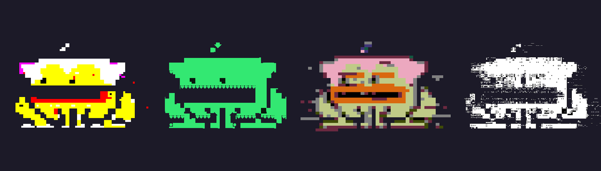

# CorruptedToadz

Toadz 变高了，四处乱窜，在沼泽的某处制造了一个虫洞。 他们都陷入了困境，现在他们被困在了过去保存在一些糟糕的 PC 上的平行沼泽中。 您可以检索它们，但不会破坏 toadz.jpegCorruptedToadz 是使用手动独特的过程创建的 图形。CrypToadz 持有者独家提供：1 CrypToadz = 1 CorruptedToadz 配置您的 CorruptedToadz：https://www.corruptedtoadz.com

CorruptedToadz NFT - 常见问题（FAQ）

▶ 什么是 CorruptedToadz？

CorruptedToadz 是一个 NFT（不可替代令牌）集合。存储在区块链上的数字艺术品集合。

▶ 有多少 CorruptedToadz 代币？

总共有 696 个 CorruptedToadz NFT。目前，98 位所有者的钱包中至少有一个 CorruptedToadz NTF。

▶ 最近卖出了多少 CorruptedToadz？

过去 30 天内售出 0 个 CorruptedToadz NFT。

