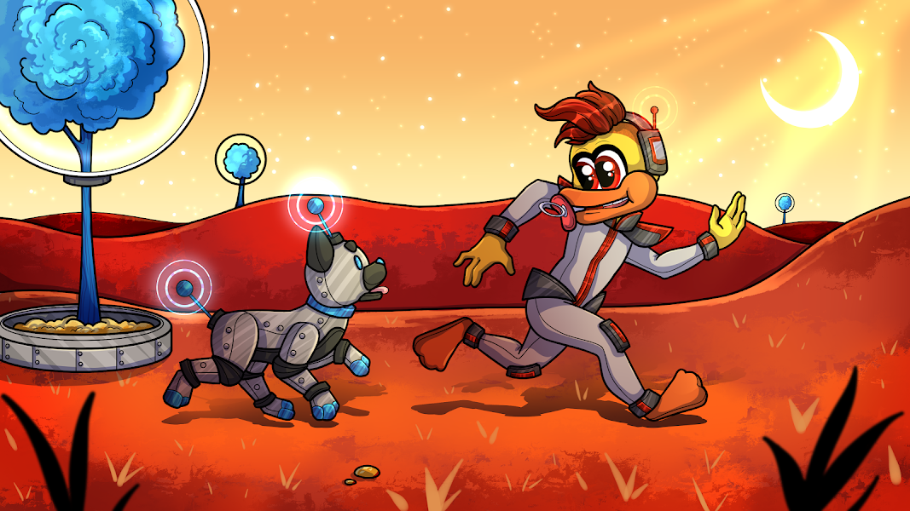

# Cosmic Babies

Cosmic Labs(Babies) NFT 在过去 7 天内售出 2 次。Cosmic Labs（婴儿）的总销售额为 $24.48。Cosmic Labs(Babies) NFT 的平均价格为 12.2 美元。Cosmic Labs(Babies) 拥有者 217 人，总供应量 1,323 个。

每个 2D Cosmic Baby 都会解锁一个可在 The SandboxGame 中玩的 3D Voxel Cosmic Baby。

Cosmic Labs（婴儿）NFT - 常见问题（FAQ）

▶ 什么是宇宙实验室（婴儿）？

Cosmic Labs(Babies) 是一个 NFT (Non-fungible token) 集合。存储在区块链上的数字艺术品集合。

▶ Cosmic Labs（婴儿）代币有多少？

总共有 1,323 个 Cosmic Labs（婴儿）NFT。目前 217 位所有者的钱包中至少有一个 Cosmic Labs(Babies) NTF。

▶ Cosmic Labs(Babies) 最贵的促销是什么？

最昂贵的 Cosmic Labs(Babies) NFT 是 [Cosmic Baby #59]它于 2022-06-21（2 个月前）以 16.5 美元的价格售出。

▶ 最近卖出了多少Cosmic Labs（婴儿）？

过去 30 天内共售出 4 个 Cosmic Labs(Babies) NFT。

