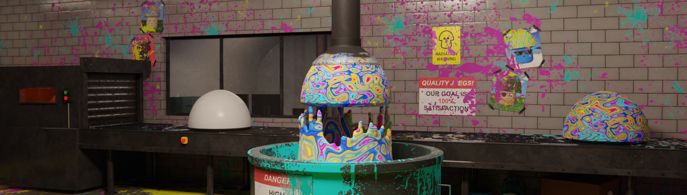

# Cosmic Caps

Cosmic Caps 是一种不可替代的物种，由 10,000 种独特的真菌组成，它们从 shroomiverse 进入 metaverse！ Cosmic Caps 即将成为动画电影系列的一部分！ 现在是您获得自己的 Cosmic Cap 并加入社区的机会。成为真菌的一员，加入我们的动画短片系列的第一集！目前可在我们的网站 CosmicCapsNFT.com 上获得铸币。

Cosmic Caps NFT - 常见问题（FAQ）

▶ 什么是宇宙帽？

Cosmic Caps 是一个 NFT（非同质代币）集合。存储在区块链上的数字艺术品集合。

▶ 有多少 Cosmic Caps 代币？

总共有 356 个 Cosmic Caps NFT。目前，133 位所有者的钱包中至少有一个 Cosmic Caps NTF。

▶ 最近卖出了多少个宇宙帽？

过去 30 天内共售出 0 个 Cosmic Caps NFT。

