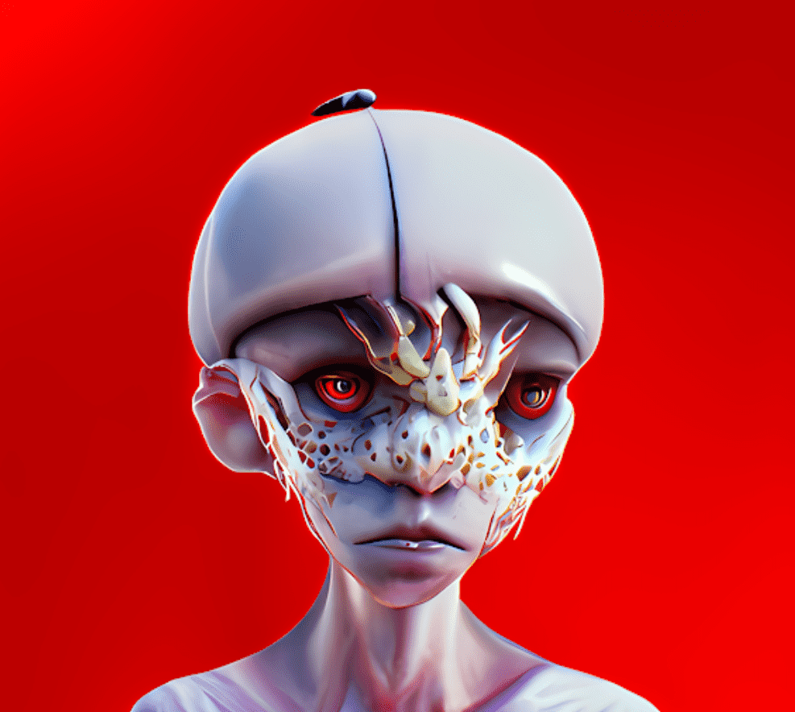

# Cosmic Clones

亿万年前，变种人在地底深处播下种子。 几千年来，克隆人一直在等待。 成长、观察和吸收这个星球的生命力。现在，种子已经准备好了。 宇宙克隆开始觉醒。 很快，他们将给这个世界带来毁灭。地球将颤抖。 山会裂开。 深处将沸腾，克隆时代将开始。
花会开花
在每一次毁灭之后，都会有重生。
宇宙克隆已经孵化并将这个世界撕成碎片。 然而，从灰烬中，花朵开始绽放。
花儿正在蔓延，很快他们将开始重建这片土地的工作。
种植你的花朵，养育你的花园，并再生你的克隆人。
加入集体。 抵抗是徒劳的。

