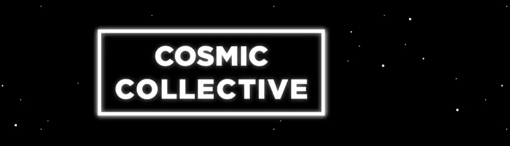

# Cosmic Collective Pass

公告：Cosmic Clones Holder Airdrop 即将于 8 月 15 日推出 - 黄金 x5 次空投，Vapor、Emerald、Ocean 和 Sunbeam 的 x2 次空投。1,111 个 COSMIC 集体通行证。 超越您最疯狂梦想的 1/1 AI 创作的独家集体。 加入集体。 不要抗拒。

宇宙集体通行证。NFT - 常见问题（FAQ）

▶ 什么是 宇宙集体通行证 的“Spy Booth”版本。？

班克斯的“间谍亭”版本。是一个 NFT（不可替代代币）集合。存储在区块链上的数字艺术品集合。

▶ 班克斯的“宇宙集体通行证。代币存在吗？

总共有 7 个班克斯的“宇宙集体通行证”版本。NFT。目前，98 位车主至少拥有一个班克斯的“间谍展位”版本。NTF 在他们的钱包里。

▶ 班克斯的“宇宙集体通行证”版数。最近有卖吗？

有 0 个班克斯的“宇宙集体通行证”版本。过去 30 天内售出的 NFT。

