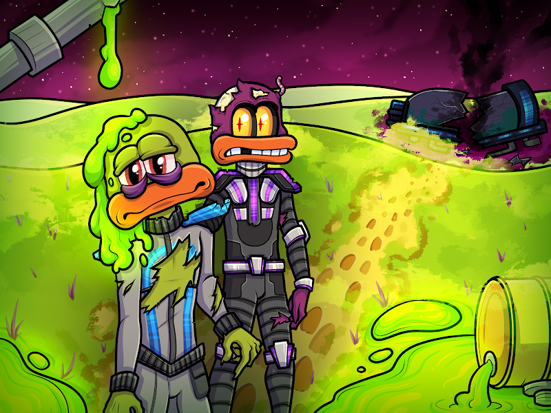

# Cosmic Mutants

1 只变异鸭子将解锁 1 只变异 VX 鸭子用于沙盒（即将推出）

Cosmic Labs（突变体）NFT - 常见问题（FAQ）
▶ 什么是宇宙实验室（突变体）？
Cosmic Labs(Mutants) 是一个 NFT (Non-fungible token) 集合。存储在区块链上的数字艺术品集合。
▶ Cosmic Labs(Mutants) 代币有多少？
总共有 1,000 个 Cosmic Labs（突变体）NFT。目前，653 位所有者的钱包中至少有一个 Cosmic Labs(Mutants) NTF。
▶ 最昂贵的 Cosmic Labs(Mutants) 销售是什么？
最昂贵的 Cosmic Labs(Mutants) NFT 是 Cosmic Mutant #128。它于 2022-06-06（3 个月前）以 31.7 美元的价格售出。
▶ 最近卖出了多少 Cosmic Labs(Mutants)？
过去 30 天内共售出 9 个 Cosmic Labs(Mutants) NFT。
▶ 有哪些流行的 Cosmic Labs(Mutants) 替代品？
许多拥有 Cosmic Labs(Mutants) NFT 的用户还拥有 Cosmic Babies、 Cosmic Fusions、 AnimeTracks和 Trippy GAN Toadz。

