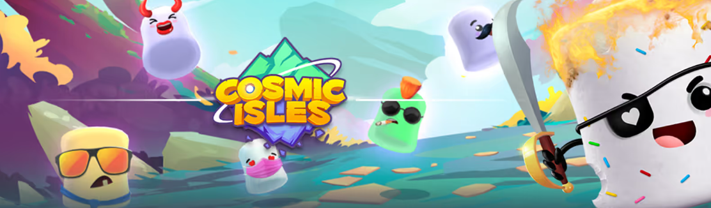

# Cosmic Marshmallows

Cosmic Marshmallows 是一系列含糖的不合群，是第一批加入你在 Cosmic Isles 冒险的宠物伙伴！ 每个 Marshmallow 都代表 Cosmic Isles 虚拟世界中的一个独特伙伴，并解锁奖励游戏模式和赚取机会。 与宇宙咖啡杯一起享用！

Cosmic Marshmallows NFT - 常见问题（FAQ）
▶ 什么是宇宙商店？
Cosmic Marshmallows 是一个 NFT（不可替代代币）系列。存储在区块链上的数字艺术品集合。
▶Cosmic Marshmallows 代币有多少？
总共有 3 个 Cosmic Marshmallows NFT。目前 575 位所有者的钱包中至少有一个 Cosmic Marshmallows NTF。
▶ 宇宙商店第一季最近卖出了多少？
过去 30 天内共售出 0 个 Cosmic Marshmallows NFT。
▶ 有哪些流行的Cosmic Marshmallows 第 1 季替代品？
许多拥有 Cosmic Marshmallows NFT 的用户还拥有 Distant Universe、 Cosmic Babies、 Cosmic Mutants和 Cosmic Fusions。

