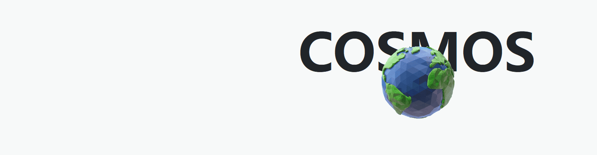

# Cosmos Space

Cosmos 受到太空无限美的启发，旨在捕捉天体物理学的复杂性。这个限量系列包括 5555 颗独特的行星。

Cosmos Space NFT - 常见问题（FAQ）
▶ 什么是宇宙空间？
Cosmos Space 是一个 NFT（Non-fungible token）集合。存储在区块链上的数字艺术品集合。
▶ Cosmos Space 代币有多少？
Cosmos Space NFT 总共有 5,332 个。目前，2,689 位所有者的钱包中至少有一个 Cosmos Space NTF。
▶ 最近卖出了多少 Cosmos Space？
过去 30 天内共售出 0 个 Cosmos Space NFT。
▶ 有哪些流行的 Cosmos Space 替代品？
许多拥有 Cosmos Space NFT 的用户还拥有 Eternal Elves、 Qbists、 YUUNA和 Naminori。

