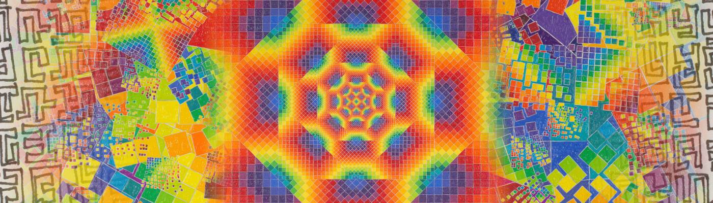

# Chaos Order Secret Writing by Allyson Grey

333 个独特的 NFT 由 Allyson GreyChaos、Order & Secret Writing 五个十年来一直是 Allyson 作品的基本组成部分。 受迷幻末世的启发，她与神性的初次接触来自她对秘密语言的感知，这是一种不可言喻的上帝口语，通过光显露，这种经历影响了她在绘画中对神圣演变的独特视觉描绘。

Allyson Gray NFT 的 Chaos Order Secret Writing - 常见问题（FAQ）
▶ 什么是 Allyson Grey 的混沌秘文？
Allyson Gray 的 Chaos Order Secret Writing 是一个 NFT（非同质代币）集合。存储在区块链上的数字艺术品集合。
▶ 由 Allyson Gray 代币撰写的混沌秩序秘文有多少？
总共有 333 篇由 Allyson Gray NFT 撰写的 Chaos Order Secret Writing。目前，226 位所有者的钱包中至少有一本由 Allyson Gray NTF 撰写的 Chaos Order Secret Writing。
▶ Allyson Gray 出售的最昂贵的混沌秩序秘密写作是什么？
Allyson Gray NFT 出售的最昂贵的 Chaos Order Secret Writing 是 Magic Nexus Letter 11。它于 2022-06-07（3 个月前）以 127 美元的价格售出。
▶ Allyson Gray 的混沌秘文最近卖出了多少？
过去 30 天内售出了 1 个由 Allyson Gray NFT 编写的 Chaos Order Secret Writing。

