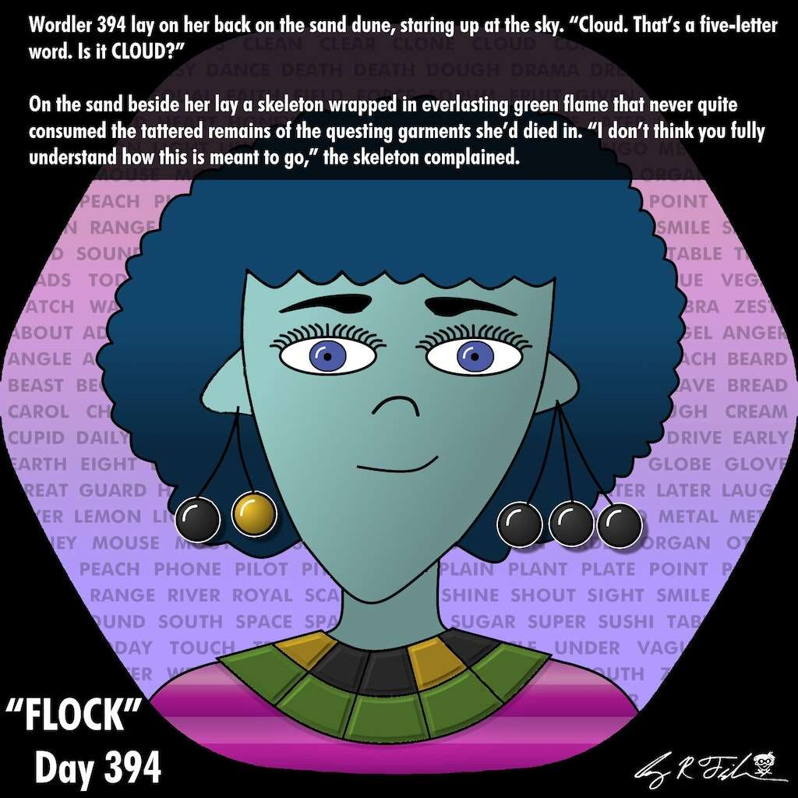

# COUNTdown to NIGHTfall 4

Greg R. Fishbone 的 WORDLES一个被诅咒的领域及其居民的持续传奇。订阅者还会收到我的 Mythoversal 时事通讯的免费版本。Wordler 394 仰面躺在沙丘上，仰望天空。 “云。这是一个五个字母的单词。是云吗？”在她身边的沙滩上躺着一具骷髅，被永恒的绿色火焰包裹着，它从未完全吞噬过她死去的探索服装的破烂残骸。“我认为你不完全理解这是怎么回事，”骷髅抱怨道. “我不是在寻找任何旧的五个字母的单词。

我需要一个特定的词来拯救你的生命免受诅咒。”“那朵云看起来像一只鸭子。是鸭子吗？”“鸭子有四个字母，”骷髅说，越来越恼火。 “你怎么这么差？”“我不擅长拼字游戏。你不擅长拼字游戏。我还有机会得到这个，而你却完全失败了。”骷髅燃烧的颅骨内，发光的眼睛瞬间闪烁。 “我在寻找一句话，而不是一次内疚之旅。”“太糟糕了，”394 说，“你的失败杀死了我所爱的人，毁了我的家，所以也许你应该为此感到内疚。”

