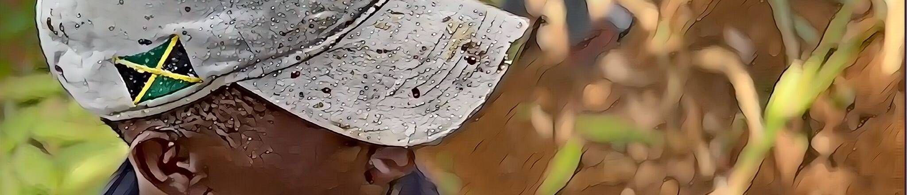

# Country painting

通过 NFT 销售与 ETH 支付合同工作。 去中心化的视频工作证明。 如果工人加密货币交易所需要收入证明来出售 ETH，这将很有用。

国画 NFT - 常见问题（FAQ）
▶ 什么是国画？
国画是一个 NFT（不可替代的代币）集合。存储在区块链上的数字艺术品集合。
▶ 国画代币有多少？
总共有 11 个国画 NFT。目前有 2 位车主的钱包中至少有一幅 Country 画 NTF。
▶ 最昂贵的乡村绘画拍卖会是什么？
NFT 出售的最昂贵的乡村绘画是 清漆木材。它于 2022 年 6 月 14 日（2 个月前）以 2.1 万美元的价格售出。
▶ 最近卖出了多少幅国画？
过去 30 天内共售出 5 份国画 NFT。

