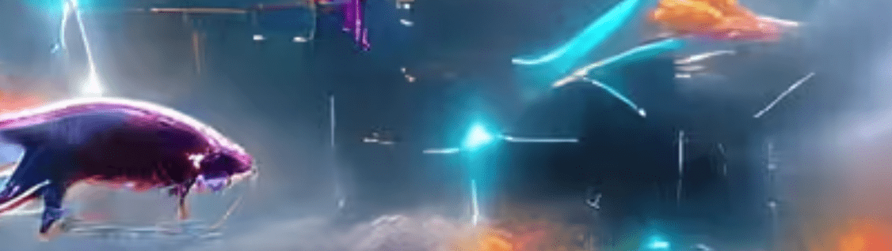

# Course Of Matter

 Course Of Matter 是由收藏家、艺术家、DJ、设计师、开发人员、企业家和区块链爱好者 Maurii（Maurii LLC 的 Mauricio Artigas）推出的最新 NFT 系列，Course Of Matter 拥有 100 个原创 AI 生成的艺术 NFT。 总共收集了 1000 个 NFT（常见 NFT、不常见 NFT、稀有 NFT、超级稀有 NFT 和编号 NFT）Course Of Matter 是艺术、技术文化、象征主义和未来主义的实验。 所有 Course of Matter NFT Mints 的艺术作品都没有命名，让观众对艺术及其对他们的理解有了自己的理解。 Course Of Matter NFT 系列是免费的 NFT 发布。 它于 2022 年 6 月 12 日推出，公共和免费铸币厂在同一天售罄。

